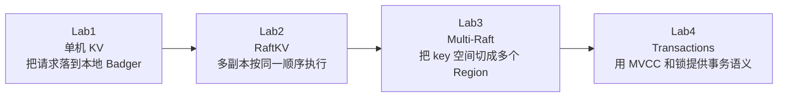
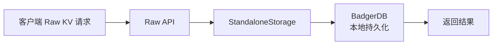
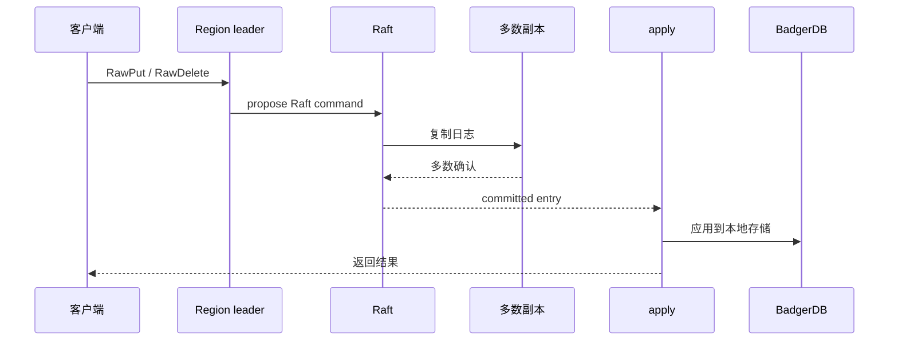
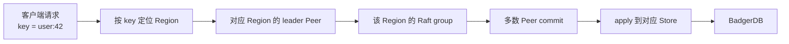
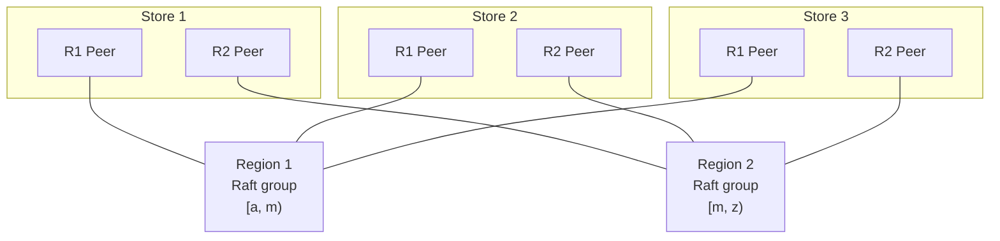
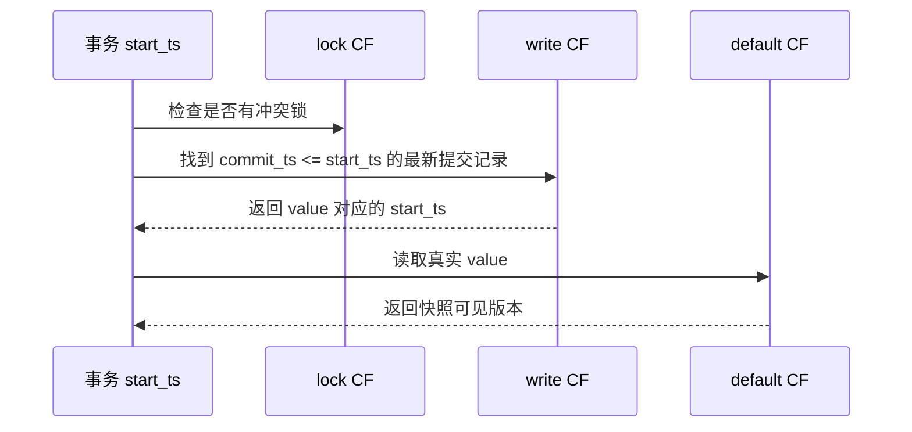
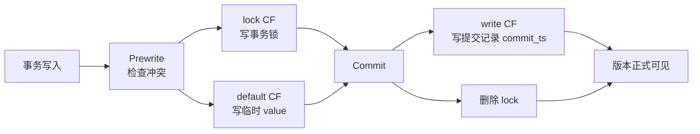
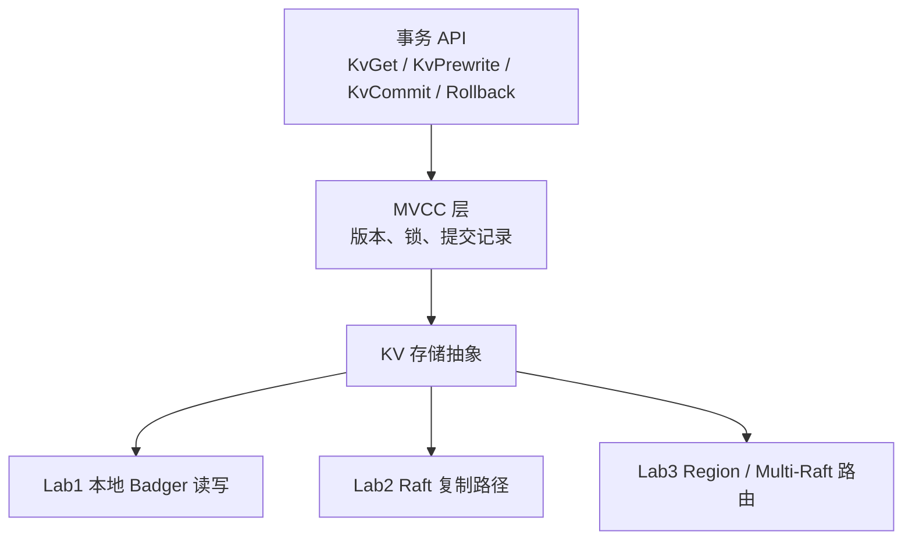
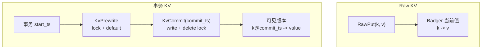

# TinyKV 理解文档

这个目录用中文白话解释 TinyKV 每个 Lab 的目标、请求路径、测试方式，以及它和 MIT 6.5840 的关系。README 只做入口页：帮你先建立全局地图，细节放在各个 Lab 文档里慢慢展开。

## 总览

TinyKV 的四个 Lab 是一层一层加能力：



可以这样记：

| 层级 | 解决什么问题 | 直觉 |
|---|---|---|
| Lab1 | 存储 | 一台机器能可靠地读、写、删、扫 |
| Lab2 | 复制 | 多台机器通过 Raft 复制同一份状态 |
| Lab3 | 扩展 | 多个 Region / Raft group 分摊 key 空间和负载 |
| Lab4 | 事务 | 同一个 key 保存多个版本，事务按时间戳读写 |

前面三层主要回答“数据怎么存、怎么复制、怎么横向扩展”。Lab4 在这些能力之上回答另一个问题：多个客户端并发读写时，怎样提供事务、快照读、写冲突检测、回滚和锁清理。

## 文档索引

| 文档 | 建议先抓住什么 |
|---|---|
| [Lab1：单机 KV](./labs/lab1-standalonekv.md) | 把 `RawGet` / `RawPut` / `RawDelete` / `RawScan` 翻译成 BadgerDB 的本地读写，顺便打好 `Storage` 和 CF 的基础 |
| [Lab2：RaftKV](./labs/lab2-raftkv.md) | 写请求不再直接落盘，而是先进入 Raft log，等多数副本提交后再 apply 到 BadgerDB |
| [Lab3：Multi-Raft](./labs/lab3-multiraftkv.md) | 一个大 Raft group 变成多个 Region，每个 Region 有自己的 Peer、Raft group、split 和调度流程 |
| [Lab4：事务](./labs/lab4-transactions.md) | 在 KV 之上实现 MVCC / Percolator 风格事务，用 `default`、`write`、`lock` 三个 CF 管理版本和锁 |
| [测试指南](./labs/testing-guide.md) | 每个 Lab 跑什么 `make projectX` 命令，测试大概在检查哪些场景 |
| [参考实现阅读路线](./reference-implementation.md) | 旧会话里筛出的完整实现参考，以及每个 Lab 应该优先对照哪些源码文件 |

## 请求路径

### Lab1：单机读写

Lab1 的核心路径最短：服务端收到 Raw KV 请求后，直接通过 `StandaloneStorage` 读写本地 BadgerDB。



这层先不考虑 Raft、Region、事务，只把本地存储抽象打牢。

### Lab2：先复制，再落盘

Lab2 把 Lab1 的本地写入放进 Raft。写请求先成为 Raft log，复制到多数副本并提交后，才会 apply 到状态机和 BadgerDB。



这一层的关键词是：选主、日志复制、commit、apply、snapshot。

### Lab3：先找 Region，再走它自己的 Raft

Lab3 解决扩展问题。请求先根据 key 找到对应 Region，再进入这个 Region 自己的 Raft group。不同 key range 可以由不同 Region 独立复制、分裂和调度。



Region、Peer、Store 的关系可以横着和竖着看：



一句话：同一个 Region 的多个 Peer 组成一个 Raft group；同一个 Store 上可以承载很多不同 Region 的 Peer。

### Lab4：在 KV 上加事务和多版本

Lab4 的重点从“请求如何复制和分片”转到“并发读写如何保持事务语义”。它使用 MVCC：同一个 key 可以有多个历史版本，事务按照自己的 `start_ts` 读取可见版本。

事务读路径：



事务写路径是 Percolator 风格的两阶段流程：



所以 Lab4 和前面三层的关系是：



前面三层让 KV 系统能存、能复制、能拆分；Lab4 让这个 KV 系统在并发场景下能表达“一个事务看到哪个版本、能不能提交、失败后怎么清理”。

Raw KV 和事务 KV 的差别可以这样看：

| 对比 | Raw KV | 事务 KV |
|---|---|---|
| 写入方式 | `RawPut` 直接写当前值 | `KvPrewrite` 先写锁和临时值，`KvCommit` 再让版本可见 |
| 读取方式 | 读当前值 | 按 `start_ts` 读快照版本 |
| 冲突处理 | 基本不处理事务冲突 | 检查锁、写冲突、回滚和清理锁 |
| 存储形态 | 一个 key 一个当前 value | 一个 key 多个版本，配合 `default/write/lock` 三个 CF |



## 推荐阅读顺序

1. 先看 [Lab1](./labs/lab1-standalonekv.md)：理解请求怎样从 Raw API 走到 Badger。
2. 再看 [Lab2](./labs/lab2-raftkv.md)：理解写请求为什么要先进入 Raft log。
3. 然后看 [Lab3](./labs/lab3-multiraftkv.md)：理解为什么要把 key 空间拆成多个 Region。
4. 最后看 [Lab4](./labs/lab4-transactions.md)：这时思维要从“复制和分片”切到“数据库事务语义”，理解为什么一个 key 要保存多个版本，以及锁、提交记录、回滚如何配合。
5. 需要跑实验时看 [测试指南](./labs/testing-guide.md)：先跑小阶段，再跑整组 `projectX`。

## 测试入口

在 TinyKV 源码根目录运行：

```bash
make project1
make project2
make project3
make project4
```

如果只想定位某个小阶段，可以看 [测试指南](./labs/testing-guide.md) 里的 `project2aa`、`project3b`、`project4c` 等命令。

## 官方资料

- TinyKV 仓库：https://github.com/talent-plan/tinykv
- Project 1 StandaloneKV：https://yunpengn.github.io/tinykv/doc/project1-StandaloneKV.html
- Project 2 RaftKV：https://yunpengn.github.io/tinykv/doc/project2-RaftKV.html
- Project 3 MultiRaftKV：https://yunpengn.github.io/tinykv/doc/project3-MultiRaftKV.html
- Project 4 Transactions：https://github.com/talent-plan/tinykv/blob/course/doc/project4-Transaction.md
- Raft 论文：https://raft.github.io/raft.pdf
- Percolator 论文：https://storage.googleapis.com/pub-tools-public-publication-data/pdf/36726.pdf

## 和 MIT 6.5840 的关系

TinyKV 和 MIT 6.5840 都适合学习分布式系统，但关注点不完全一样：

| TinyKV | MIT 6.5840 | 关系 |
|---|---|---|
| Lab1 单机 KV | KV Server 的前置练习 | 都有 KV 读写；TinyKV 更像真实数据库的存储层 |
| Lab2 RaftKV | Raft + Fault-tolerant KV | 重叠度很高，都是复制状态机和 Raft 正确性 |
| Lab3 Multi-Raft | Sharded KV | 都有分片思想；TinyKV 更贴近 TiKV 的 Region / PD 模型 |
| Lab4 Transactions | 标准 MIT 实验基本没有 | TinyKV 独有，重点是 MVCC、事务锁、两阶段提交和回滚 |

一句话：

```text
MIT 6.5840 更训练分布式系统正确性。
TinyKV 更贴近 TiKV 这类分布式数据库存储层的工程结构。
```
