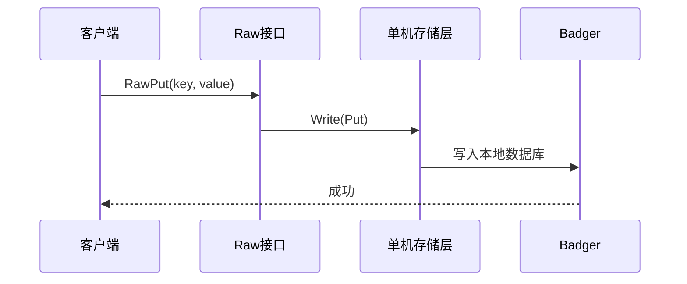
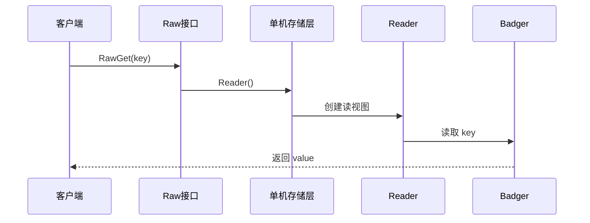

# Lab1：单机 KV

官方页面：https://yunpengn.github.io/tinykv/doc/project1-StandaloneKV.html

## 一句话

Lab1 要做一个单机版 KV 服务。

它还没有 Raft、没有多副本、没有事务。客户端发 `RawGet`、`RawPut`、`RawDelete`、`RawScan` 请求，服务端直接读写本地的 Badger 数据库。

## 先用大白话理解

Lab1 其实就是先做一个“本地小数据库”。

你可以先把它想成一个加强版的 `map`：

```go
map[string]string
```

区别是：普通 `map` 放在内存里，程序一关数据就没了；TinyKV Lab1 底下用 BadgerDB 把数据放到硬盘上，程序重启后数据还能在。

它要支持的事情很朴素：

```text
别人问：key = name 的值是什么？
TinyKV 回答：Tom

别人说：把 key = age 的值改成 18
TinyKV 就写进去

别人说：删除 key = age
TinyKV 就删掉

别人说：从 key = b 开始，往后给我 2 条
TinyKV 就按顺序扫 2 条
```

也就是：

| 操作 | 大白话 |
|---|---|
| `RawGet` | 查一个 |
| `RawPut` | 存一个 |
| `RawDelete` | 删一个 |
| `RawScan` | 连续查一批 |

整体请求链路可以先这么记：

```text
用户请求
  -> TinyKV
  -> BadgerDB
  -> 硬盘
```

Lab1 的工作，就是把用户的“查、存、删、扫”翻译成 BadgerDB 能懂的读写操作。

后面的术语都可以往这个直觉上放：

| 术语 | 先这样理解 |
|---|---|
| BadgerDB | 真正负责把数据存到硬盘的软件 |
| `Storage` | TinyKV 上层和底层存储之间的统一插座 |
| `StandaloneStorage` | Lab1 插在这个插座上的“单机存储实现” |
| Column Family / CF | 同一个数据库里的不同抽屉 |

## 要做哪两件事

### 1. 做单机存储层

相关代码：

```text
kv/storage/storage.go
kv/storage/standalone_storage/standalone_storage.go
kv/util/engine_util
```

核心接口是：

```go
type Storage interface {
    Write(ctx *kvrpcpb.Context, batch []Modify) error
    Reader(ctx *kvrpcpb.Context) (StorageReader, error)
}
```

白话解释：

| 方法 | 它做什么 |
|---|---|
| `Write` | 把一批写入或删除操作一次性写进 Badger |
| `Reader` | 创建一个读视图，用来读取单个 key 或扫描一段 key |

这里的 `ctx` 在 Lab1 里基本不用。它里面的 Region 信息要到 Lab2、Lab3 做 Raft 时才重要。

### 2. 做 Raw KV 接口

相关代码：

```text
kv/server/raw_api.go
proto/proto/kvrpcpb.proto
proto/proto/tinykvpb.proto
```

要实现四个接口：

| 接口 | 白话解释 |
|---|---|
| `RawGet` | 读一个 key |
| `RawPut` | 写一个 key |
| `RawDelete` | 删除一个 key |
| `RawScan` | 从某个 key 开始，顺序读一批 key |

举个 `RawScan` 的例子：

```text
已有数据：
a -> 1
b -> 2
c -> 3
d -> 4

RawScan(start_key = b, limit = 2)

返回：
b -> 2
c -> 3
```

## 请求怎么走

以写入为例：



以读取为例：



## CF 是什么

官方文档里会说列族，也就是 `CF`。这个名字有点吓人，其实可以先理解成：

```text
同一个数据库柜子里的不同抽屉。
```

比如同一个 key，在不同 CF 里可以有不同的值：

```text
default 抽屉：user1 -> Alice
write   抽屉：user1 -> 一条提交记录
lock    抽屉：user1 -> 一把事务锁
```

Badger 本身没有 CF，所以 TinyKV 用 `engine_util` 帮你模拟。你读写时不要直接操作 Badger，尽量走 `engine_util` 里的辅助函数。

Lab1 先把 CF 能力做出来，是为了 Lab4 的事务做准备。Lab4 会用到：

```text
default：放真正的数据
write：放提交记录
lock：放事务锁
```

## Lab1 不做什么

Lab1 不需要处理这些内容：

```text
Raft
选主
日志复制
多副本一致性
Region
事务
MVCC
调度器
```

它只负责把单机存储这块地基打好。

## 怎么测试

在 TinyKV 源码根目录运行：

```bash
make project1
```

主要测试文件：

```text
kv/server/server_test.go
```

测试大概会查：

| 测试点 | 它想确认什么 |
|---|---|
| `RawGet` | 能读到已有 key，读不到不存在的 key |
| `RawPut` | 写入后能读出来 |
| `RawDelete` | 删除后读不到 |
| `RawScan` | 能按 key 顺序扫描 |
| 读视图 | 扫描过程中不会被后续删除搞乱 |

更完整的测试命令在 [测试指南](./testing-guide.md)。

## 面试怎么说

可以这样讲：

> TinyKV Lab1 是单机 Raw KV 层。它主要做两件事：第一，把 Badger 封装成统一的 `Storage` 接口；第二，实现 `RawGet`、`RawPut`、`RawDelete`、`RawScan` 四个接口。这个 Lab 不涉及 Raft 和事务，但为后面的 RaftKV、Multi-Raft 和 MVCC 事务层提供了本地存储基础。

## 和 MIT 6.5840 的关系

Lab1 和 MIT 6.5840 的单机 KV 有一点像，但重点不同。

| 对比 | TinyKV Lab1 | MIT 6.5840 KV |
|---|---|---|
| 共同点 | 都是 KV 服务 | 都能读写 key |
| TinyKV 更关心 | Badger、CF、扫描、本地存储抽象 | 不是重点 |
| MIT 更关心 | 不是重点 | RPC、重试、版本号、线性一致 |

一句话：

```text
TinyKV Lab1 更像数据库项目的本地存储层。
MIT 的单机 KV 更像分布式系统实验的前置练习。
```

## 参考资料

- Project 1 StandaloneKV：https://yunpengn.github.io/tinykv/doc/project1-StandaloneKV.html
- TinyKV 仓库：https://github.com/talent-plan/tinykv
- 本仓库源码：`kv/storage/standalone_storage/standalone_storage.go`
- 本仓库源码：`kv/server/raw_api.go`
- 本仓库源码：`kv/storage/storage.go`
- 本仓库源码：`kv/util/engine_util`
