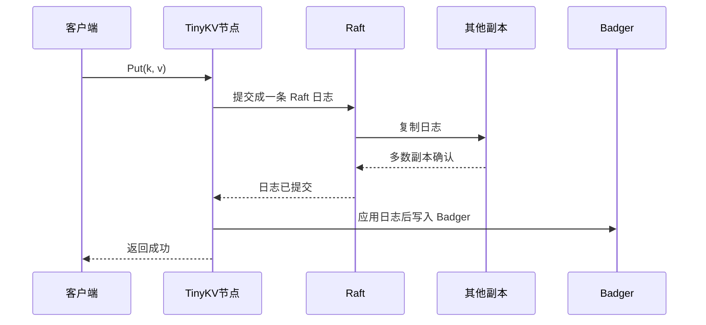

# Lab2：RaftKV

官方页面：https://yunpengn.github.io/tinykv/doc/project2-RaftKV.html

## 一句话

Lab2 要把 Lab1 的单机 KV，升级成基于 Raft 的多副本 KV。

Lab1 是：

```text
请求 -> 直接写本地 Badger
```

Lab2 变成：

```text
请求 -> 先写 Raft 日志 -> 多数副本确认 -> 再写 Badger
```

更完整一点，写请求会走这条路：

```text
客户端请求
  -> leader
  -> 变成一条 Raft log
  -> 复制到多数副本
  -> commit
  -> apply 到状态机
  -> 写入 Badger
  -> 返回结果
```

这样做的目的很简单：只要大多数节点还活着，服务就能继续工作，而且多个副本的数据不会乱。

更直观地说，Lab2 解决的是 Lab1 的两个问题：

```text
问题 1：只有一台机器，挂了就没服务。
解决：复制到多台机器。

问题 2：多台机器各写各的，数据会乱。
解决：用 Raft 规定所有机器执行同一串操作。
```

Raft log 可以先理解成“操作流水账”：

```text
log[1] = Put name Tom
log[2] = Put age 18
log[3] = Delete city
```

BadgerDB 是执行流水账后的最终结果：

```text
name = Tom
age = 18
city 不存在
```

所以 Lab2 的关键不是“怎么把 value 写进硬盘”，而是：

```text
所有副本怎样先同意这条操作排在第几位，
然后再按同样顺序写进各自的硬盘。
```

## Lab2 分成三部分

| 部分 | 要做什么 | 白话解释 |
|---|---|---|
| A 部分 | 实现 Raft 算法 | 让一组节点能选主、复制日志、达成多数派 |
| B 部分 | 把 KV 接到 Raft 上 | 客户端写入必须先进入 Raft 日志 |
| C 部分 | 做日志压缩和快照 | 日志不能无限长，旧日志要压缩掉 |

一句话串起来：

```text
Part A 做“大家怎么达成一致”
Part B 做“KV 请求怎么使用这个一致性”
Part C 做“日志太多以后怎么减肥”
```

官方测试命令的层级是这样：

| 命令 | 所属阶段 | 要证明什么 |
|---|---|---|
| `make project2aa` | Lab2A 的第 1 小段 | 选主、投票、心跳能工作 |
| `make project2ab` | Lab2A 的第 2 小段 | 日志复制、冲突处理、commit 能工作 |
| `make project2ac` | Lab2A 的第 3 小段 | RawNode/Ready/Advance 这层接口能工作 |
| `make project2a` | Lab2A 整体 | 上面三个小段一起过 |
| `make project2b` | Lab2B | KV 请求真正经过 Raft 再 apply |
| `make project2c` | Lab2C | log GC、snapshot、落后副本恢复 |
| `make project2` | Lab2 全部 | A/B/C 全部通过 |

所以 `2AA` 不是一个独立的大 Lab，它只是 `2A` 里的第一个检查点。过了 `2AA`，只能说明“选主这块基本通了”，还不能说 Lab2A 完成。

## 本地实现记录

本地这份实现里，Lab2 已经完成并通过最近一次完整回归：

```bash
make project2
```

回归时额外注意过一点：`project2b` 和 `project2c` 在 Makefile 里部分子测试带了 `|| true`，所以不能只看最后的退出码，还要扫日志里有没有 `FAIL`、`panic`、`fatal error`。

本地学习和实现顺序可以这样复盘：

| 顺序 | 阶段 | 当时主要在解决什么 |
|---|---|---|
| 1 | Lab2A / 2AA | 先让 Raft 节点能选主、投票、发心跳 |
| 2 | Lab2A / 2AB | 再让 leader 能复制日志、处理冲突、推进 commit |
| 3 | Lab2A / 2AC | 把 Raft 包成 `RawNode`，通过 `Ready/Advance` 和上层交互 |
| 4 | Lab2B | 把 KV command 放进 Raft，apply 后再写 Badger 并回调客户端 |
| 5 | Lab2C | 加上 log GC、snapshot 生成和落后副本恢复 |

可以把 Lab2 的代码分界记成下面这样：

| 代码区域 | 属于哪层 | 判断方式 |
|---|---|---|
| `raft/raft.go`、`raft/log.go`、`raft/rawnode.go` | Raft 算法层 | 只处理 term、vote、log、commit、message，不知道 KV 是什么 |
| `kv/raftstore/peer_storage.go` | Raft 持久化层 | 负责把 Raft log、HardState、snapshot 和底层存储接起来 |
| `kv/raftstore/peer_msg_handler.go` | raftstore 驱动层 | 负责 propose、处理 Ready、apply committed entries、响应客户端 |

一句话总结本地讨论里的重点：

```text
Lab2A 先把“多数派同意同一串日志”做出来；
Lab2B 再把“KV 请求必须进入这串日志”接上；
Lab2C 最后处理“日志不能无限长，落后副本要靠快照追上”。
```

## A 部分：实现 Raft

相关代码：

```text
raft/raft.go
raft/log.go
raft/rawnode.go
raft/storage.go
```

这部分只关心 Raft 本身，还不关心 KV。

Part A 就是在实现一个通用的 Raft 模块。它不应该知道上层是 KV、SQL 还是别的东西，它只处理日志、任期、投票和提交。

要实现的核心能力：

| 能力 | 白话解释 |
|---|---|
| 选主 | 一组节点里选出一个主节点，也就是 leader |
| 心跳 | 主节点定期告诉别人“我还活着” |
| 日志复制 | 主节点把操作复制给从节点，也就是 follower |
| 提交 | 一条日志被多数副本保存后，才算提交 |
| 应用 | 提交后的日志才能交给上层真正执行 |

TinyKV 里的 Raft 不自己起线程、不自己发网络包、不自己写磁盘。它只把“应该做的事”放到 `Ready` 里，交给上层处理。

可以这样理解：

```text
Raft 只负责判断：
  该发什么消息
  该保存什么日志
  哪些日志已经提交

上层负责真正去做：
  发网络包
  写磁盘
  执行 KV 操作
```

也就是说，TinyKV 的 Raft 更像一个“决策引擎”：

```text
它告诉外面：
  这些消息该发出去
  这些日志该持久化
  这些日志已经提交了

但它自己不真的发网络包，也不真的写 Badger。
```

Lab2A 可以按三个文件层次拆：

| 小阶段 | 重点文件 | 主要要写什么 |
|---|---|---|
| 2AA | `raft/raft.go` | `tick`、`Step`、`becomeFollower/Candidate/Leader`、投票、心跳、leader noop |
| 2AB | `raft/log.go`、`raft/raft.go` | `RaftLog` 索引管理、AppendEntries、日志冲突截断、leader 更新 `Progress`、推进 commit |
| 2AC | `raft/rawnode.go` | `RawNode` 封装、`Ready`、`HasReady`、`Advance`、HardState/SoftState 变化 |

学习顺序建议也是这个顺序：先让集群能选主，再让 leader 能复制日志，最后把 Raft 模块暴露给上层应用。

### 2AA：选主、投票、心跳在做什么

2AA 的目标是先让 Raft 集群有一个稳定的 leader。这个阶段还不重点处理业务日志复制，而是先把 Raft 的角色转换、投票、心跳跑通。

核心文件是 `raft/raft.go`。

| 函数或消息 | 作用 |
|---|---|
| `newRaft` | 根据 `Config` 和底层 `Storage` 创建 Raft 节点，恢复 term、vote、commit、peer 列表和日志状态。 |
| `tick` | 推进逻辑时钟。follower/candidate 超时后触发选举，leader 到心跳间隔后触发心跳。 |
| `becomeFollower` | 把当前节点切成 follower，记录当前 term 和 leader，并清空投票过程中的临时状态。 |
| `becomeCandidate` | 把当前节点切成 candidate，term 加一，先给自己投票，然后向其他节点请求投票。 |
| `becomeLeader` | 把当前节点切成 leader，初始化每个 peer 的复制进度，并追加一条空日志。 |
| `MsgHup` | 本地选举触发消息，一般由 election timeout 产生。 |
| `MsgBeat` | leader 本地心跳触发消息，一般由 heartbeat timeout 产生。 |
| `MsgRequestVote` | candidate 发给其他节点的投票请求。 |
| `MsgRequestVoteResponse` | follower 对投票请求的回复，candidate 根据多数票决定是否成为 leader。 |
| `MsgHeartbeat` | leader 发给 follower 的心跳，用来维持 leader 身份，并携带当前 commit 进度。 |
| `MsgHeartbeatResponse` | follower 对心跳的回复，后面的 2AB 会用它帮助 leader 发现落后节点并补日志。 |

2AA 的主线可以这样看：

```text
follower 的 electionElapsed 不断增加
  -> 超过 randomizedElectionTimeout
  -> tick 注入 MsgHup
  -> Step 处理 MsgHup
  -> becomeCandidate
  -> 给自己投票，向其他 peer 发送 MsgRequestVote
  -> 收到多数 MsgRequestVoteResponse
  -> becomeLeader
  -> 追加 leader noop entry
  -> 后续定期通过 MsgBeat 发送 MsgHeartbeat
```

这里最容易困惑的是 leader 刚当选后追加的空日志，也就是 noop entry。它没有业务数据，但很重要：

```text
leader 当选
  -> 追加当前 term 的空日志
  -> 复制给多数节点
  -> 这能帮助 leader 安全地推进当前 term 的 commit
```

原因是 Raft 里 leader 不能只靠旧 term 的日志来确认自己当前 term 的领导权。当前 term 的一条日志被多数派接受后，leader 才能更安全地推进提交位置。

### 2AB：日志复制、冲突处理、commit 在做什么

2AB 的目标是让 leader 不只是能当选，还能把上层提交的日志复制到 follower，并在多数派确认后推进 commit。

核心文件是 `raft/log.go` 和 `raft/raft.go`。

| 函数或消息 | 作用 |
|---|---|
| `RaftLog.LastIndex` | 返回当前日志最后一条 entry 的 index。leader 给新日志分配 index 时会用到。 |
| `RaftLog.Term` | 查询某个 index 对应的 term，用来做日志匹配和冲突检测。 |
| `RaftLog.appendEntries` | 把新日志追加到本地。如果发现同 index 但 term 不同，就从冲突点截断后重写。 |
| `RaftLog.unstableEntries` | 找出还没有持久化到 storage 的日志，2AC 的 `Ready` 会把它们交给上层保存。 |
| `RaftLog.nextEnts` | 找出已经 committed 但还没有 applied 的日志，2AC 的 `Ready` 会把它们交给上层 apply。 |
| `sendAppend` | leader 给指定 follower 发送 `MsgAppend`，里面包含 prev log 信息和要复制的新 entries。 |
| `handleAppendEntries` | follower 处理 leader 发来的 `MsgAppend`，先检查 prev log 是否匹配，再追加 entries。 |
| `maybeCommit` | leader 根据各 peer 的 `Match` 进度判断是否有日志被多数派复制，然后推进 committed。 |
| `MsgPropose` | 上层提交给 leader 的新日志提案，leader 会给 entry 填 term/index 并追加到本地日志。 |
| `MsgAppend` | leader 发给 follower 的日志复制请求，也就是 Raft 论文里的 AppendEntries。 |
| `MsgAppendResponse` | follower 对日志复制的回复，leader 用它更新该 follower 的 `Progress`。 |

2AB 的正常日志复制主线是：

```text
上层向 leader 提交 MsgPropose
  -> leader 给 entry 填当前 term 和下一个 index
  -> leader append 到自己的 RaftLog
  -> leader 更新自己的 Progress
  -> leader 给每个 follower 发送 MsgAppend
  -> follower 检查 prev log index/term 是否匹配
  -> 匹配则 appendEntries，并回复成功
  -> leader 收到 MsgAppendResponse
  -> 更新 follower 的 Match/Next
  -> maybeCommit 检查是否达到多数派
  -> committed 前进
  -> leader 再发 MsgAppend/heartbeat 告诉 followers 新 commit
```

这里的关键是 `Progress`：

| 字段 | 含义 |
|---|---|
| `Match` | leader 认为这个 peer 已经复制成功的最高日志 index。 |
| `Next` | leader 下一次准备发给这个 peer 的日志起点。 |

成功复制时：

```text
follower 回复成功，并带上复制到的 index
  -> leader 把 Progress.Match 推到这个 index
  -> Progress.Next 变成 Match + 1
```

复制失败时：

```text
follower 回复失败
  -> 说明 prev log 对不上
  -> leader 把 Progress.Next 往回退
  -> 下次 sendAppend 从更早的位置重新尝试
```

所以 2AB 的核心不是简单地 append。它真正解决的是这几个问题：

```text
新日志怎么从 leader 复制到 follower
follower 日志和 leader 不一致时怎么修正
leader 怎么知道哪些日志被多数派接受
commit index 怎么安全推进
```

### 2AC：`rawnode.go` 每个函数负责什么

`rawnode.go` 是 Raft 模块暴露给上层的接口层。它不负责真正写磁盘、发网络、执行 KV；它负责把底层 `Raft` 的内部变化整理成 `Ready`，让上层按顺序处理。

| 名称 | 作用 |
|---|---|
| `SoftState` | 表示不用持久化的易失状态，比如当前 leader 和当前节点角色。 |
| `Ready` 结构体 | 表示上层现在必须处理的一批输出：待持久化日志、HardState、快照、待发送消息、已提交日志。 |
| `RawNode` | 包住底层 `Raft`，给上层提供 `Tick`、`Step`、`Ready`、`Advance` 这种更稳定的接口。 |
| `NewRawNode` | 创建 `RawNode` 和内部 `Raft`，并记录初始状态，后面用来判断状态是否发生变化。 |
| `Tick` | 推进一次逻辑时钟，用于触发选举超时和 leader 心跳。 |
| `Campaign` | 主动发起选举，本质是向 Raft 注入本地 `MsgHup`。 |
| `Propose` | 提议一条普通业务日志，把上层数据包装成 `EntryNormal` 交给 leader 复制。 |
| `ProposeConfChange` | 提议一条成员变更日志；这里只是写入日志，不会立刻改变成员。 |
| `ApplyConfChange` | 在成员变更日志提交后，真正把节点加入或移出 Raft peer 集合。 |
| `Step` | 处理外部传进来的 Raft 消息，同时拒绝不该从网络进入的本地消息。 |
| `Ready()` | 生成当前这一批要交给上层处理的 raft 输出。 |
| `HasReady` | 判断现在有没有必要调用 `Ready`，避免上层空转。 |
| `Advance` | 上层处理完上一批 `Ready` 后调用，用来推进 `stabled`、`applied` 等内部游标。 |
| `GetProgress` | leader 用来查看每个 peer 的日志复制进度。 |
| `TransferLeader` | 请求把 leader 身份转移给指定节点，是否成功取决于目标节点是否追上日志。 |

最关键的是 `Ready -> 上层处理 -> Advance` 这个循环：

```text
Raft 产生变化
  -> HasReady 返回 true
  -> Ready 拿到待处理内容
  -> 上层持久化日志/发送消息/apply committed entries
  -> Advance 告诉 RawNode：这一批已经处理完了
```

## B 部分：把 KV 请求放进 Raft

Lab1 里 `RawPut` 是直接写 Badger。Lab2 不能这么做。

这是 Lab2 最重要的变化：

```text
Lab1:
RawPut(name, Tom)
  -> 直接写 Badger

Lab2:
RawPut(name, Tom)
  -> 变成一条 Raft command
  -> 进入 Raft log
  -> 多数派确认
  -> commit
  -> apply
  -> 写 Badger
```

Lab2 的写入流程变成：



核心变化：

```text
不是“收到请求就写数据库”。
而是“Raft 确认提交后，才能写数据库”。
```

这样多个副本才会按同样的顺序执行同样的操作。

## B 部分里的几个词

| 词 | 白话解释 |
|---|---|
| `Store` | 一个 TinyKV 进程，也就是一个存储节点 |
| `Peer` | 某个 Raft 组在一个 Store 上的副本 |
| `Region` | 一组 Peer 组成的 Raft 组，也代表一段 key 范围 |

Lab2 先简化：

```text
只有一个 Region。
这个 Region 管全部 key。
每个 Store 上只有一个 Peer。
```

Lab3 才会变成多个 Region。

Lab2B 主要改的是 raftstore 外壳，不是 Raft 算法本身：

| 文件 | 负责什么 |
|---|---|
| `kv/storage/raft_storage/raft_server.go` | 把 Raw API 的读写包装成 `RaftCmdRequest` 发给 raftstore |
| `kv/raftstore/peer_storage.go` | `SaveReadyState`，把 `Ready` 里的日志和 HardState 持久化到 raftdb |
| `kv/raftstore/peer_msg_handler.go` | `proposeRaftCommand`、`HandleRaftReady`，处理 propose、persist、send、apply、callback |
| `kv/raftstore/peer.go` | Peer 状态和 callback 管理，理解为 raftstore 里的单个 Region 副本 |

这部分的核心检查点是：客户端的 `Get/Put/Delete/Snap` 不能绕过 Raft，必须被包装成 Raft log，commit 后才 apply 到 Badger。

## C 部分：快照和日志压缩

Raft 日志不能一直增长。否则系统跑久了，日志会越来越大。

所以要做两件事：

```text
1. 把当前状态保存成快照。
2. 删除已经包含在快照里的旧日志。
```

如果某个从节点落后太多，主节点也不用一条条补旧日志，可以直接发快照让它追上。

白话版流程：

```text
主节点发现从节点太落后
  -> 旧日志已经被删掉
  -> 生成或读取快照
  -> 把快照发给从节点
  -> 从节点用快照恢复状态
```

Lab2C 是在 A/B 已经能跑起来之后，补长期运行必需的清理能力：

| 模块 | 要处理什么 |
|---|---|
| Raft 层 | leader 在日志被截断后，必要时向落后 follower 发送 snapshot；follower 收到 snapshot 后恢复 Raft 状态 |
| raftstore 层 | 处理 `CompactLog` admin command，更新 `RaftApplyState.TruncatedState`，调度 raftlog-gc worker 删除旧日志 |
| PeerStorage | 生成、应用、持久化 snapshot 相关状态，并清理过期的 raft/kv 元数据 |

一句话：Lab2B 让系统能复制请求，Lab2C 让这个复制系统跑久以后不会被无限增长的日志拖垮。

## 怎么测试

Lab2 总测试：

```bash
make project2
```

也可以分开跑：

```bash
make project2aa
make project2ab
make project2ac
make project2b
make project2c
```

每个小阶段大概测：

| 命令 | 测什么 |
|---|---|
| `make project2aa` | 选主、投票、心跳 |
| `make project2ab` | 日志复制、日志冲突、提交 |
| `make project2ac` | Raft 和上层交互的接口 |
| `make project2a` | Part A 整体，也就是 2AA/2AB/2AC 全部一起过 |
| `make project2b` | KV 请求是否真的经过 Raft 后再执行 |
| `make project2c` | 快照、日志压缩、落后副本恢复 |

主要测试文件：

```text
raft/raft_test.go
raft/raft_paper_test.go
raft/rawnode_test.go
kv/test_raftstore/test_test.go
```

更完整的测试命令在 [测试指南](./testing-guide.md)。

## 面试怎么说

可以这样讲：

> TinyKV Lab2 是把单机 KV 改造成 Raft 复制状态机。A 部分实现 Raft 的选主、日志复制和提交；B 部分把客户端 KV 请求包装成 Raft 日志，等多数副本提交后再应用到 Badger；C 部分做日志压缩和快照，让长期运行的系统不会保存无限日志，也能让落后副本通过快照追上。

## 和 MIT 6.5840 的关系

Lab2 和 MIT 6.5840 重叠很大。

| TinyKV Lab2 | MIT 6.5840 | 关系 |
|---|---|---|
| A 部分：Raft | Lab3 Raft | 高度相似，都是 Raft |
| B 部分：RaftKV | Lab4 Fault-tolerant KV | 都是把 KV 请求放进 Raft |
| C 部分：快照 | Lab3/Lab4 的快照部分 | 都要压缩日志，让落后副本恢复 |

主要区别：

```text
MIT 更像教学抽象：内存状态、模拟网络、应用通道。
TinyKV 更像真实系统：Badger、raftdb、kvdb、Region、Peer、快照文件。
```

如果已经做过 MIT，可以这样迁移理解：

| MIT 6.5840 里的感觉 | TinyKV Lab2 里的对应 |
|---|---|
| `Raft` 模块 | `raft/raft.go`、`raft/rawnode.go` |
| `applyCh` | `Ready.CommittedEntries` + raftstore apply 流程 |
| KV 状态机通常是内存 map | KV 最终写到 BadgerDB |
| 一个 KV group | 一个 Region / Peer 体系，Lab2 先基本可以当成一个 Raft group |
| tester 模拟网络 | raftstore/router/transport 负责消息流转 |

## 参考资料

- Project 2 RaftKV：https://yunpengn.github.io/tinykv/doc/project2-RaftKV.html
- TinyKV 仓库：https://github.com/talent-plan/tinykv
- Raft 论文：https://raft.github.io/raft.pdf
- 本仓库源码：`raft/raft.go`
- 本仓库源码：`raft/rawnode.go`
- 本仓库源码：`raft/log.go`
- 本仓库源码：`kv/storage/raft_storage`
- 本仓库源码：`kv/raftstore`
