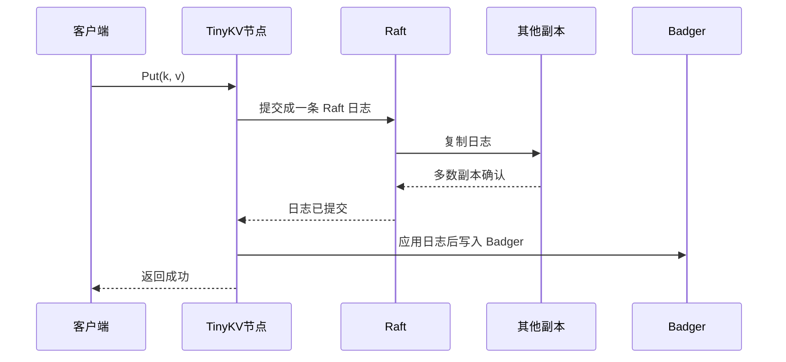

# Lab2：RaftKV

官方页面：https://yunpengn.github.io/tinykv/doc/project2-RaftKV.html

## 一句话

Lab2 要把 Lab1 的单机 KV，升级成基于 Raft 的多副本 KV。

Lab1 是：

```text
请求 -> 直接写本地 Badger
```

Lab2 变成：

```text
请求 -> 先写 Raft 日志 -> 多数副本确认 -> 再写 Badger
```

更完整一点，写请求会走这条路：

```text
客户端请求
  -> leader
  -> 变成一条 Raft log
  -> 复制到多数副本
  -> commit
  -> apply 到状态机
  -> 写入 Badger
  -> 返回结果
```

这样做的目的很简单：只要大多数节点还活着，服务就能继续工作，而且多个副本的数据不会乱。

更直观地说，Lab2 解决的是 Lab1 的两个问题：

```text
问题 1：只有一台机器，挂了就没服务。
解决：复制到多台机器。

问题 2：多台机器各写各的，数据会乱。
解决：用 Raft 规定所有机器执行同一串操作。
```

Raft log 可以先理解成“操作流水账”：

```text
log[1] = Put name Tom
log[2] = Put age 18
log[3] = Delete city
```

BadgerDB 是执行流水账后的最终结果：

```text
name = Tom
age = 18
city 不存在
```

所以 Lab2 的关键不是“怎么把 value 写进硬盘”，而是：

```text
所有副本怎样先同意这条操作排在第几位，
然后再按同样顺序写进各自的硬盘。
```

## Lab2 分成三部分

| 部分 | 要做什么 | 白话解释 |
|---|---|---|
| A 部分 | 实现 Raft 算法 | 让一组节点能选主、复制日志、达成多数派 |
| B 部分 | 把 KV 接到 Raft 上 | 客户端写入必须先进入 Raft 日志 |
| C 部分 | 做日志压缩和快照 | 日志不能无限长，旧日志要压缩掉 |

一句话串起来：

```text
Part A 做“大家怎么达成一致”
Part B 做“KV 请求怎么使用这个一致性”
Part C 做“日志太多以后怎么减肥”
```

## A 部分：实现 Raft

相关代码：

```text
raft/raft.go
raft/log.go
raft/rawnode.go
raft/storage.go
```

这部分只关心 Raft 本身，还不关心 KV。

Part A 就是在实现一个通用的 Raft 模块。它不应该知道上层是 KV、SQL 还是别的东西，它只处理日志、任期、投票和提交。

要实现的核心能力：

| 能力 | 白话解释 |
|---|---|
| 选主 | 一组节点里选出一个主节点，也就是 leader |
| 心跳 | 主节点定期告诉别人“我还活着” |
| 日志复制 | 主节点把操作复制给从节点，也就是 follower |
| 提交 | 一条日志被多数副本保存后，才算提交 |
| 应用 | 提交后的日志才能交给上层真正执行 |

TinyKV 里的 Raft 不自己起线程、不自己发网络包、不自己写磁盘。它只把“应该做的事”放到 `Ready` 里，交给上层处理。

可以这样理解：

```text
Raft 只负责判断：
  该发什么消息
  该保存什么日志
  哪些日志已经提交

上层负责真正去做：
  发网络包
  写磁盘
  执行 KV 操作
```

也就是说，TinyKV 的 Raft 更像一个“决策引擎”：

```text
它告诉外面：
  这些消息该发出去
  这些日志该持久化
  这些日志已经提交了

但它自己不真的发网络包，也不真的写 Badger。
```

## B 部分：把 KV 请求放进 Raft

Lab1 里 `RawPut` 是直接写 Badger。Lab2 不能这么做。

这是 Lab2 最重要的变化：

```text
Lab1:
RawPut(name, Tom)
  -> 直接写 Badger

Lab2:
RawPut(name, Tom)
  -> 变成一条 Raft command
  -> 进入 Raft log
  -> 多数派确认
  -> commit
  -> apply
  -> 写 Badger
```

Lab2 的写入流程变成：



核心变化：

```text
不是“收到请求就写数据库”。
而是“Raft 确认提交后，才能写数据库”。
```

这样多个副本才会按同样的顺序执行同样的操作。

## B 部分里的几个词

| 词 | 白话解释 |
|---|---|
| `Store` | 一个 TinyKV 进程，也就是一个存储节点 |
| `Peer` | 某个 Raft 组在一个 Store 上的副本 |
| `Region` | 一组 Peer 组成的 Raft 组，也代表一段 key 范围 |

Lab2 先简化：

```text
只有一个 Region。
这个 Region 管全部 key。
每个 Store 上只有一个 Peer。
```

Lab3 才会变成多个 Region。

## C 部分：快照和日志压缩

Raft 日志不能一直增长。否则系统跑久了，日志会越来越大。

所以要做两件事：

```text
1. 把当前状态保存成快照。
2. 删除已经包含在快照里的旧日志。
```

如果某个从节点落后太多，主节点也不用一条条补旧日志，可以直接发快照让它追上。

白话版流程：

```text
主节点发现从节点太落后
  -> 旧日志已经被删掉
  -> 生成或读取快照
  -> 把快照发给从节点
  -> 从节点用快照恢复状态
```

## 怎么测试

Lab2 总测试：

```bash
make project2
```

也可以分开跑：

```bash
make project2aa
make project2ab
make project2ac
make project2b
make project2c
```

每个小阶段大概测：

| 命令 | 测什么 |
|---|---|
| `make project2aa` | 选主、投票、心跳 |
| `make project2ab` | 日志复制、日志冲突、提交 |
| `make project2ac` | Raft 和上层交互的接口 |
| `make project2b` | KV 请求是否真的经过 Raft 后再执行 |
| `make project2c` | 快照、日志压缩、落后副本恢复 |

主要测试文件：

```text
raft/raft_test.go
raft/raft_paper_test.go
raft/rawnode_test.go
kv/test_raftstore/test_test.go
```

更完整的测试命令在 [测试指南](./testing-guide.md)。

## 面试怎么说

可以这样讲：

> TinyKV Lab2 是把单机 KV 改造成 Raft 复制状态机。A 部分实现 Raft 的选主、日志复制和提交；B 部分把客户端 KV 请求包装成 Raft 日志，等多数副本提交后再应用到 Badger；C 部分做日志压缩和快照，让长期运行的系统不会保存无限日志，也能让落后副本通过快照追上。

## 和 MIT 6.5840 的关系

Lab2 和 MIT 6.5840 重叠很大。

| TinyKV Lab2 | MIT 6.5840 | 关系 |
|---|---|---|
| A 部分：Raft | Lab3 Raft | 高度相似，都是 Raft |
| B 部分：RaftKV | Lab4 Fault-tolerant KV | 都是把 KV 请求放进 Raft |
| C 部分：快照 | Lab3/Lab4 的快照部分 | 都要压缩日志，让落后副本恢复 |

主要区别：

```text
MIT 更像教学抽象：内存状态、模拟网络、应用通道。
TinyKV 更像真实系统：Badger、raftdb、kvdb、Region、Peer、快照文件。
```

如果已经做过 MIT，可以这样迁移理解：

| MIT 6.5840 里的感觉 | TinyKV Lab2 里的对应 |
|---|---|
| `Raft` 模块 | `raft/raft.go`、`raft/rawnode.go` |
| `applyCh` | `Ready.CommittedEntries` + raftstore apply 流程 |
| KV 状态机通常是内存 map | KV 最终写到 BadgerDB |
| 一个 KV group | 一个 Region / Peer 体系，Lab2 先基本可以当成一个 Raft group |
| tester 模拟网络 | raftstore/router/transport 负责消息流转 |

## 参考资料

- Project 2 RaftKV：https://yunpengn.github.io/tinykv/doc/project2-RaftKV.html
- TinyKV 仓库：https://github.com/talent-plan/tinykv
- Raft 论文：https://raft.github.io/raft.pdf
- 本仓库源码：`raft/raft.go`
- 本仓库源码：`raft/rawnode.go`
- 本仓库源码：`raft/log.go`
- 本仓库源码：`kv/storage/raft_storage`
- 本仓库源码：`kv/raftstore`
