# Lab3：Multi-Raft

官方页面：https://yunpengn.github.io/tinykv/doc/project3-MultiRaftKV.html

## 一句话

Lab3 要把“一个 Raft 组管理全部 key”，升级成“多个 Raft 组分别管理不同 key 范围”。

Lab2 是：

```text
全部 key -> 一个 Region -> 一个 Raft 组
```

Lab3 变成：

```text
[a, h) -> Region 1 -> Raft 组 1
[h, p) -> Region 2 -> Raft 组 2
[p, z) -> Region 3 -> Raft 组 3
```

这样数据量大了以后，就可以把不同范围的数据分摊到不同节点上。

从 Lab2 到 Lab3，可以先看这张图：

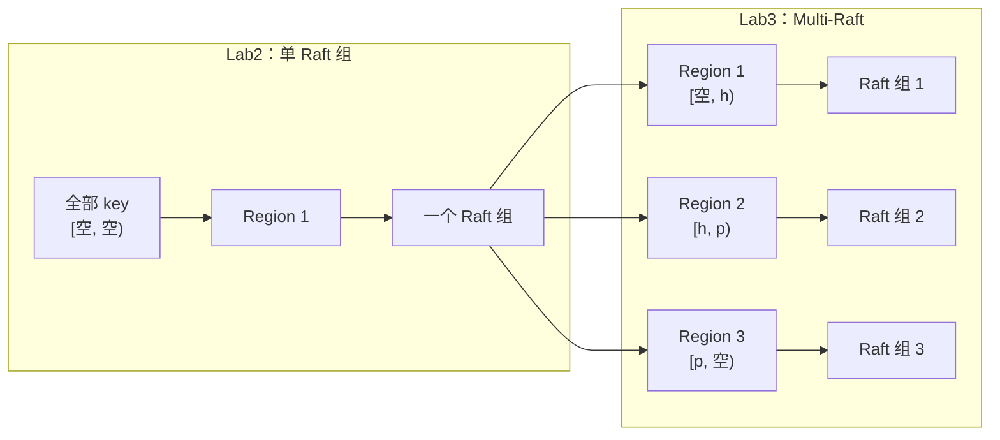

Lab3 的目标不是“把 Raft 换掉”，而是让系统里同时跑很多个 Raft 组。每个 Raft 组只负责一段 key。

## 先把三个词搞清楚

Lab3 最容易卡住的是 `Store`、`Peer`、`Region` 这三个词。先不用管源码，可以先这样记：

| 词 | 大白话 |
|---|---|
| `Store` | 一台存储机器，或者一个 TinyKV 存储进程 |
| `Region` | 一个分片，也就是一段连续的 key 范围 |
| `Peer` | 某个 Region 在某个 Store 上的一份副本 |

比如 `Region 1` 管 `[a, m)` 这段 key。为了高可用，它不会只存在一台机器上，而是会复制到多台 `Store` 上：

```text
Region 1: [a, m)

Peer 1 在 Store 1
Peer 2 在 Store 2
Peer 3 在 Store 3
```

这三个 Peer 保存的是同一个 Region 的三份副本，它们组成一个 Raft 组。

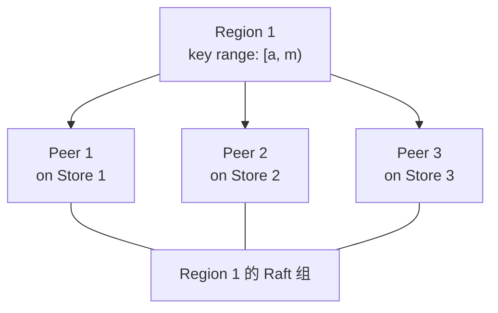

所以不要把 `Peer` 理解成一台机器。更准确是：

```text
Store 是机器 / 进程级别。
Peer 是数据副本级别。
```

一个 Store 上可以有很多 Peer，因为一台机器可以承载很多分片副本：

```text
Store 1:
  Region 1 的 Peer
  Region 2 的 Peer
  Region 5 的 Peer

Store 2:
  Region 1 的 Peer
  Region 3 的 Peer
  Region 6 的 Peer
```

横着看：

```text
Region 1 的多个 Peer -> 一个 Raft 组
```

竖着看：

```text
Store 1 上有很多不同 Region 的 Peer
```

可以用这张表理解：

| | Store 1 | Store 2 | Store 3 |
|---|---|---|---|
| Region 1 | Peer 1 | Peer 2 | Peer 3 |
| Region 2 | Peer 4 | Peer 5 | Peer 6 |
| Region 3 | Peer 7 | Peer 8 | Peer 9 |

Lab3 叫 Multi-Raft，就是因为系统里会同时有很多 Region，而每个 Region 背后都有一个自己的 Raft 组。

这张图把“横着看”和“竖着看”画出来：

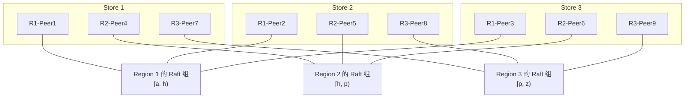

这张图很关键：

```text
横向：同一个 Region 的多个 Peer 组成一个 Raft 组。
纵向：同一个 Store 上承载很多不同 Region 的 Peer。
```

## Lab3 分成三部分

| 部分 | 要做什么 | 白话解释 |
|---|---|---|
| A 部分 | Raft 成员变更和主节点转移 | Raft 组可以加副本、删副本、换主节点 |
| B 部分 | raftstore 支持管理命令和 Region 分裂 | 让 TinyKV 真正能改副本、拆 Region |
| C 部分 | 调度器 | 调度器观察集群，然后告诉节点搬副本 |

对应到测试命令：

| 命令 | 所属阶段 | 要证明什么 |
|---|---|---|
| `make project3a` | Lab3A | Raft 模块支持 conf change 和 leader transfer |
| `make project3b` | Lab3B | raftstore 能执行 ChangePeer、TransferLeader、Split，并维护 Region 元信息 |
| `make project3c` | Lab3C | scheduler 能处理 Region heartbeat，并生成 balance-region operator |
| `make project3` | Lab3 全部 | A/B/C 全部通过 |

## A 部分：Raft 组成员变化

Lab2 里可以先理解成：一个 Raft 组的成员基本固定。Lab3 开始要支持动态变化。

这部分说白了就是：

```text
一个分片 Region 内部，
哪些 Store 上有这个 Region 的副本，
以及哪个 Peer 当 leader，
都可以动态调整。
```

要做三类事情：

| 能力 | 白话解释 |
|---|---|
| 加副本 | 给某个 Region 增加一个新 Peer |
| 删副本 | 从某个 Region 移除一个 Peer |
| 转移主节点 | 把某个 Region 的 leader 主动交给另一个 Peer |

为什么需要？

```text
节点太满了，要把副本搬出去。
节点下线了，要把它的副本删掉。
主节点压力太大了，要把主节点换到别的节点。
```

从实现角度看，`ChangePeer` 不是某台机器自己偷偷改本地配置。它也要先进入 Raft，等多数副本同意后才能真正生效：

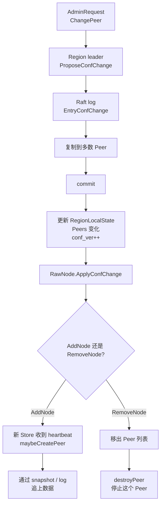

这张图说明了一个关键点：

```text
Region 的副本集合也是一致性状态。
不能只在 leader 本地改，必须通过 Raft 提交后再改。
```

举个例子，原来 `Region 1` 有三个副本：

```text
Region 1:
  Peer 1 on Store 1
  Peer 2 on Store 2
  Peer 3 on Store 3
```

如果集群新加了 `Store 4`，想让它也保存 `Region 1` 的副本，就可以加一个 Peer：

```text
Region 1:
  Peer 1 on Store 1
  Peer 2 on Store 2
  Peer 3 on Store 3
  Peer 4 on Store 4
```

如果 `Store 2` 要下线，就可以删掉 `Region 1` 在 `Store 2` 上的 Peer：

```text
Region 1:
  Peer 1 on Store 1
  Peer 3 on Store 3
  Peer 4 on Store 4
```

这里不是说 `Store 2` 这台机器一定从集群里消失了，而是说：

```text
Store 2 不再保存 Region 1 这个分片的数据副本。
```

leader transfer 也是同一个思路。比如 leader 原来在 `Store 1`：

```text
Region 1:
  Peer 1 on Store 1  <- leader
  Peer 2 on Store 2
  Peer 3 on Store 3
```

如果 `Store 1` 太忙，可以把 leader 转给 `Store 3`：

```text
Region 1:
  Peer 1 on Store 1
  Peer 2 on Store 2
  Peer 3 on Store 3  <- leader
```

这不会搬数据，只是换谁来当这个 Region 的主节点。

把 add/remove peer 画成流程就是：

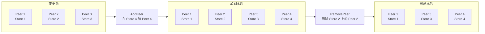

上面这张图看的是副本分布变化。落到执行细节上，`AddNode` 和 `RemoveNode` 的 apply 动作不一样：

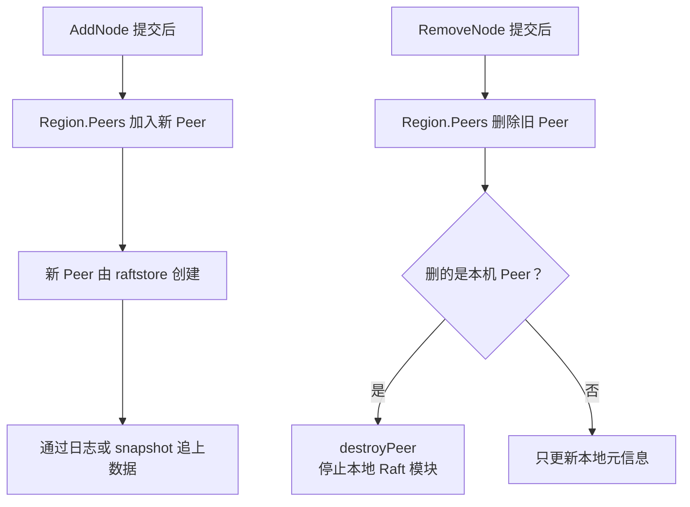

新增 Peer 的重点是“先加入，再追数据”；删除 Peer 的重点是“先提交删除，再停掉被删 Peer”。这样每个节点看到的副本集合变化顺序是一致的。

Leader transfer 画出来是：

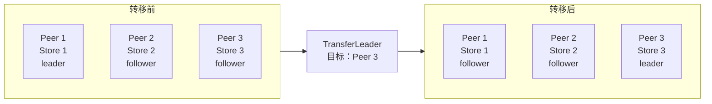

上面这张图只画了“谁当 leader”的结果。真实消息流程更像一次被指定目标的选举：旧 leader 先帮目标 Peer 补齐日志，然后让它立刻竞选。

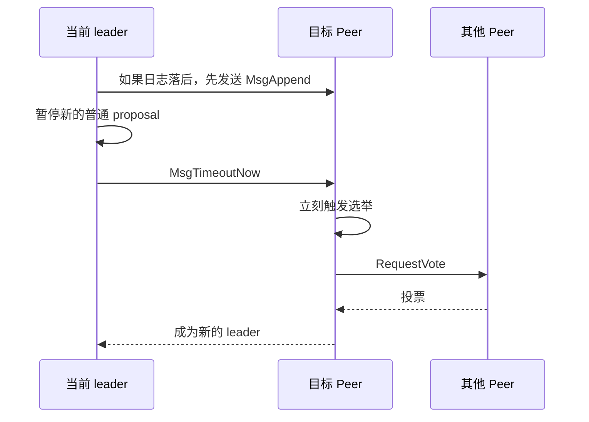

记住一句话就行：leader transfer 不搬数据、不改 Peer 列表，所以不会增加 `conf_ver`；它只是把同一个 Region 的 leader 换到另一个 Peer 上。

Lab3A 主要改 Raft 层：

| 文件 | 主要任务 |
|---|---|
| `raft/raft.go` | 处理 `MsgTransferLeader`、`MsgTimeoutNow`，实现 `addNode`、`removeNode`，成员变化后更新 `Prs` |
| `raft/rawnode.go` | 实现 `ProposeConfChange`、`ApplyConfChange`、`TransferLeader` 这些给上层调用的接口 |
| `proto/proto/eraftpb.proto` | 通常只需要理解已有消息和结构，不建议随便改协议 |

这部分只是让 Raft 算法“具备能力”，真正把 Region 元信息改掉是在 Lab3B。

## B 部分：Region 分裂

一个 Region 太大时，要拆成两个 Region。

例子：

```text
拆分前：
Region 1 管 [a, z)

按 m 拆分后：
Region 1 管 [a, m)
Region 2 管 [m, z)
```

这样原来一个 Raft 组承受的压力，就可以逐渐分散到多个 Raft 组。

为什么要拆？

```text
一个 Region 太大：
  数据太多
  请求太多
  一个 Raft 组压力太大
  迁移成本也高

拆成多个 Region 后：
  不同 key 范围可以独立复制
  可以独立调度
  也可以独立承载请求
```

比如：

```text
key = apple  -> Region 1: [a, m)
key = user99 -> Region 2: [m, z)
```

分裂后，每个 Region 都有自己的 Peer 和 Raft 组：

```text
Region 1:
  Peer 1 on Store 1
  Peer 2 on Store 2
  Peer 3 on Store 3

Region 2:
  Peer 4 on Store 1
  Peer 5 on Store 2
  Peer 6 on Store 3
```

注意：两个 Region 可以先落在同一批 Store 上，后面再由调度器慢慢搬到更合适的位置。

Region split 可以画成这样：

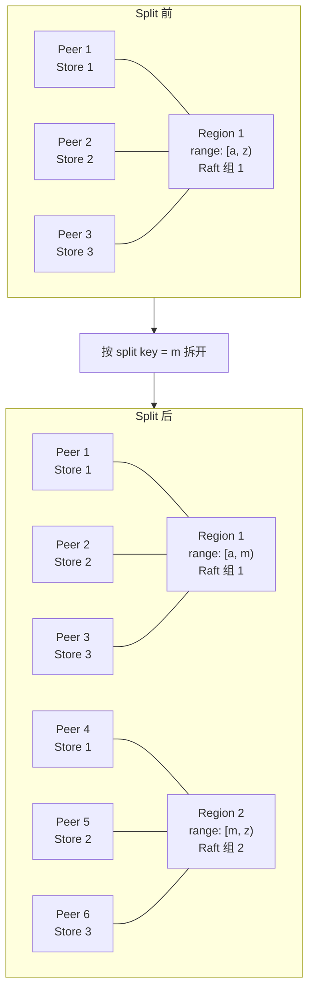

这里容易误解的一点是：split 不是把所有数据立刻跨机器搬一遍。TinyKV 用的是 range 分片，很多时候主要是改 Region 元信息：

```text
原来一个 Region 负责 [a, z)
现在两个 Region 分别负责 [a, m) 和 [m, z)
```

这部分还要让 raftstore 能处理管理命令，比如：

```text
转移主节点
增加副本
删除副本
分裂 Region
```

这些管理命令也要走 Raft。原因很简单：Region 的元信息也必须在多数副本之间保持一致。

Split 在代码里的大致链路是：

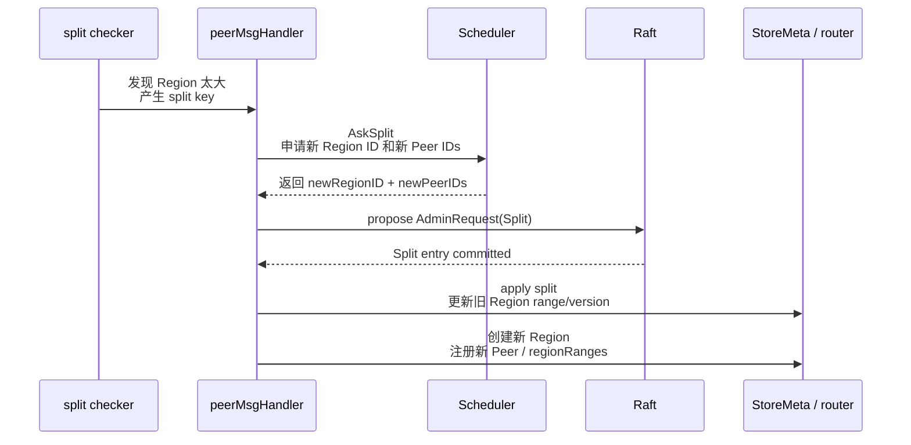

这张图里要抓住两点：

```text
1. 新 Region 和新 Peer 的 ID 需要向 Scheduler 申请，不能本地随便编。
2. Split 最终也要作为 Raft admin command 提交，提交后才更新 Region 元信息。
```

Lab3B 主要改 raftstore：

| 文件 | 主要任务 |
|---|---|
| `kv/raftstore/peer_msg_handler.go` | propose/apply admin command：`TransferLeader`、`ChangePeer`、`Split` |
| `kv/raftstore/peer.go` | 创建新 Peer、destroy 被移除 Peer、维护 callback 和 Peer 状态 |
| `kv/raftstore/router.go` | 理解多个 Region/Peer 如何路由消息，通常更多是读懂框架 |
| `kv/raftstore/runner/split_check.go` | 理解 split key 如何产生，通常框架已给出 |

这部分的核心不是“复制 value”，而是让 Region 的范围、Peer 列表、RegionEpoch、storeMeta、router 注册关系都在 Raft 提交后一起变正确。

## C 部分：调度器

调度器有点像 TiKV 里的 PD。

它可以先理解成“集群管理员”。它不直接处理用户读写请求，而是做三件事：

```text
1. 收集每个 Region 的心跳。
2. 根据全局情况判断哪里不均衡。
3. 给 TinyKV 节点发调度命令。
```

比如：

```text
Store 1 上 Region 太多
Store 4 上 Region 太少
调度器决定把某个副本从 Store 1 搬到 Store 4
```

这个“搬副本”通常不是直接拷贝文件，而是借助 A 部分的成员变化：

```text
1. 给这个 Region 在 Store 4 上加一个 Peer。
2. 等 Store 4 上的新 Peer 通过 Raft 追上数据。
3. 删除 Store 1 上的旧 Peer。
```

所以 C 部分依赖 A 部分：调度器负责做决定，真正修改 Region 副本集合还是通过 Raft 成员变更完成。

整体感觉是：

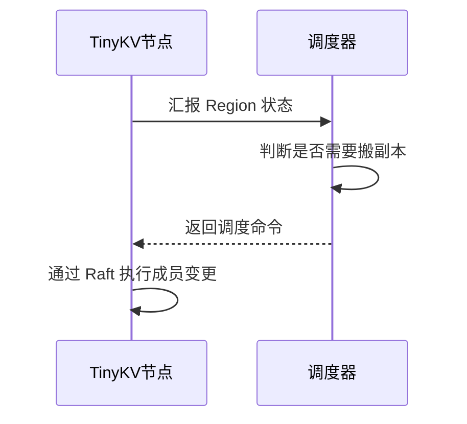

更完整地看，调度器做的是“观察 -> 决策 -> 返回 operator”：

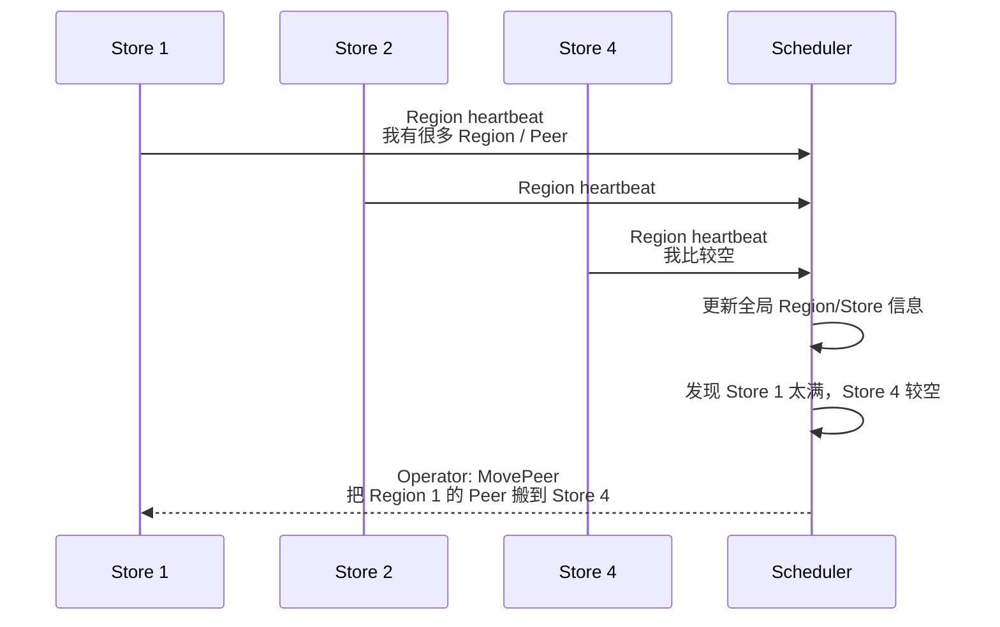

`MovePeer` 里面通常包含多个小步骤：

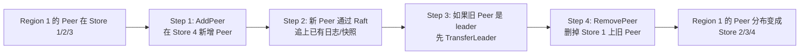

这张图能看出 C 部分和 A 部分的关系：Scheduler 只是决定要搬，真正的搬迁动作还是靠 A 部分的 `AddPeer`、`RemovePeer`、`TransferLeader`。

Lab3C 主要改 scheduler：

| 文件 | 主要任务 |
|---|---|
| `scheduler/server/cluster.go` | `processRegionHeartbeat`：接收 Region 心跳，过滤过期 epoch，更新 region tree 和 store 状态 |
| `scheduler/server/schedulers/balance_region.go` | `Schedule`：找出 region 过多的 store，把合适的 Region 迁到更空的 store |
| `scheduler/server/schedule/operator` | 理解 `MovePeer` operator 如何拆成 AddPeer / TransferLeader / RemovePeer |

一句话：Lab3B 是节点执行管理命令，Lab3C 是调度器决定该给哪些节点发管理命令。

## A/B/C 串起来看

Lab3 不是三个孤立功能，它们其实是一条完整链路：

```text
Region 太大
  -> B 部分把它 split 成两个 Region

某些 Store 上 Peer 太多
  -> C 部分的调度器发现不均衡
  -> 调度器决定把某个 Region 的 Peer 搬走
  -> A 部分通过 add peer / remove peer 真正完成搬迁

某些 Store 上 leader 太多
  -> C 部分的调度器发现 leader 不均衡
  -> A 部分通过 leader transfer 换 leader
```

所以可以这样记：

| 部分 | 角色 |
|---|---|
| A 部分 | 提供“怎么改一个 Region 的副本集合”的能力 |
| B 部分 | 提供“怎么把一个大 Region 拆小”的能力 |
| C 部分 | 提供“什么时候该改、该拆、该搬”的全局视角 |

更口语一点：

```text
B 负责把分片切小。
A 负责移动某个分片的副本、换 leader。
C 负责站在全局看，决定该不该移动。
```

## 一个重要概念：Region 版本

Lab3 里会看到 `RegionEpoch`。它可以理解成 Region 元信息的版本号。

它主要防止一种问题：

```text
网络分区里，一个旧主节点还以为自己是主节点。
它向调度器汇报了旧的 Region 信息。
调度器不能被它骗到。
```

所以调度器会看 Region 版本。如果版本太旧，就拒绝这次汇报。

图上看是这样：

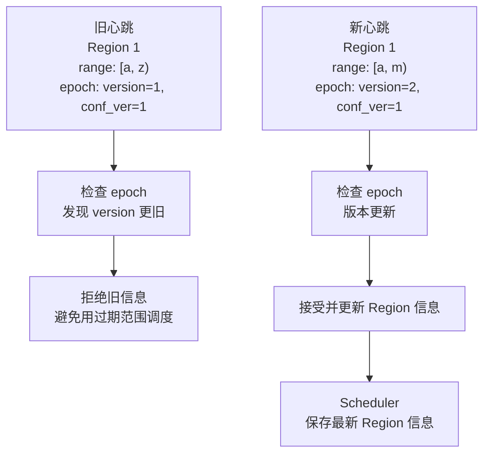

简单记：

```text
Region split 会让 version 变大。
加删 Peer 会让 conf_ver 变大。
Scheduler 用 RegionEpoch 判断谁的信息更新。
```

## 怎么测试

Lab3 总测试：

```bash
make project3
```

也可以分开跑：

```bash
make project3a
make project3b
make project3c
```

每个小阶段大概测：

| 命令 | 测什么 |
|---|---|
| `make project3a` | Raft 层能不能加副本、删副本、转移主节点 |
| `make project3b` | raftstore 能不能处理成员变更、主节点转移、Region 分裂 |
| `make project3c` | 调度器能不能处理心跳，并做基本负载均衡 |

主要测试文件：

```text
raft/raft_test.go
raft/rawnode_test.go
kv/test_raftstore/test_test.go
scheduler/server/cluster_test.go
scheduler/server/schedulers/balance_test.go
```

更完整的测试命令在 [测试指南](./testing-guide.md)。

## 面试怎么说

可以这样讲：

> TinyKV Lab3 是把单 Raft 组扩展成 Multi-Raft。Lab2 可以理解成一个 Region 管全部 key，Lab3 会把 key 空间切成多个 Region，每个 Region 背后都有自己的 Raft 组。这个 Lab 要支持给 Region 加副本、删副本、转移 leader、分裂 Region，以及让调度器根据 heartbeat 做副本均衡。它的目标是让 KV 存储能横向扩展。

## 和 MIT 6.5840 的关系

Lab3 和 MIT 6.5840 Lab5 都有“分片”的味道，但不是同一个模型。

| 对比 | TinyKV Lab3 | MIT Lab5 |
|---|---|---|
| 分片方式 | 按 key 范围切成 Region | 固定数量 shard |
| 每片背后 | 一个 Raft 组 | 一个 Raft 组 |
| 谁调度 | TinyScheduler | shard controller |
| 更像什么 | TiKV/PD | 教学版分片 KV |

一句话：

```text
MIT Lab5 更强调 shard 迁移时的线性一致。
TinyKV Lab3 更强调真实数据库里的 Region、成员变更和调度。
```

## 参考资料

- Project 3 MultiRaftKV：https://yunpengn.github.io/tinykv/doc/project3-MultiRaftKV.html
- TinyKV 仓库：https://github.com/talent-plan/tinykv
- 本仓库源码：`raft/raft.go`
- 本仓库源码：`raft/rawnode.go`
- 本仓库源码：`kv/raftstore`
- 本仓库源码：`scheduler/server`
- 本仓库源码：`scheduler/server/schedulers`
