# Lab4：事务

官方页面：https://github.com/talent-plan/tinykv/blob/course/doc/project4-Transaction.md

## 先建立直觉

Lab4 不要一上来就背 MVCC、Percolator、2PC。先把它想成一个多人共用的小仓库。

Lab1 到 Lab3 已经让这个仓库越来越靠谱：

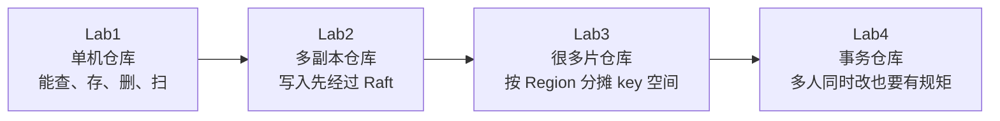

Lab1-3 解决的是：

```text
数据怎么存
数据怎么复制
数据怎么拆分到多个 Region
```

Lab4 解决的是：

```text
多个客户端同时读写时，怎么保证读到一个稳定视图。
一次事务改多个 key 时，怎么保证要么都成功，要么都不成功。
```

换成更生活化的话：

```text
Lab1-3 像是在建设仓库本身。
Lab4 像是给仓库加账本、临时占用牌、正式入账记录。

有人正在改某件货，先挂一把锁。
货物有历史版本，读的人按自己进门时的时间看账。
改完以后写一条正式记录，别人才看得到。
改到一半失败，就把临时东西撤掉，并留一条“这次作废”的记录。
```

这就是 Lab4 的直觉。

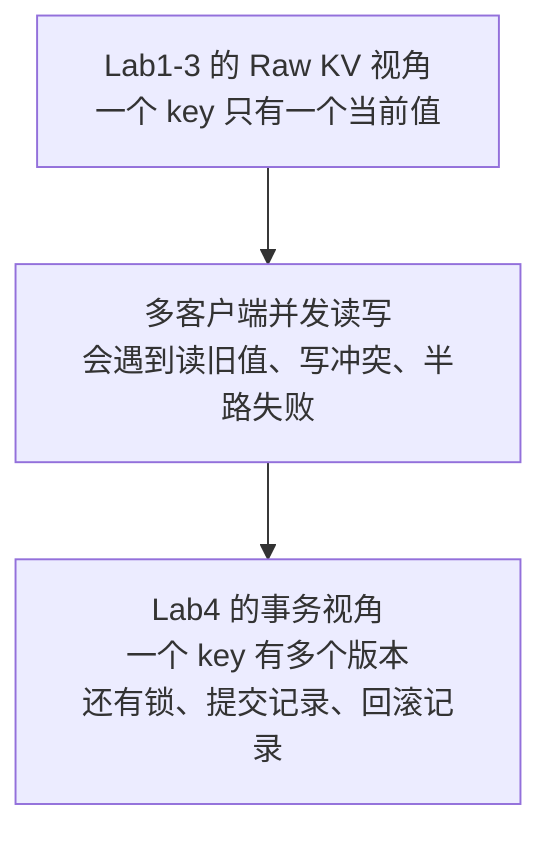

## 一句话

Lab4 要在 KV 之上实现事务。

更准确一点：

```text
TinyKV 在已有存储和 Raft 能力上，实现 MVCC + Percolator 风格事务。
```

它要保证两个核心感觉：

| 感觉 | 术语 | 白话解释 |
|---|---|---|
| 我读到的是事务开始时的世界 | Snapshot Isolation | 数据库像在事务开始那一刻被冻结 |
| 我这批写入要么都成功，要么都失败 | Atomicity | 不会出现只写了一半的尴尬状态 |

注意：事务 API 和 Raw API 不应该混着用。Raw API 是直接读写当前值，事务 API 是按时间戳和版本读写；混用以后，事务语义就不好保证了。

## 为什么要多版本

先看一个普通 KV 的问题。

```text
x = 1
后来 x = 2
```

如果只保存一个当前值，那么 `x=1` 就被覆盖掉了。可是事务需要这样的能力：

```text
事务 T 在时间 15 开始。
另一个事务在时间 20 把 x 改成 2。
T 后面再读 x 时，仍然应该看到时间 15 那一刻的世界。
```

所以同一个 key 不能只存一个值。它要存多个历史版本。

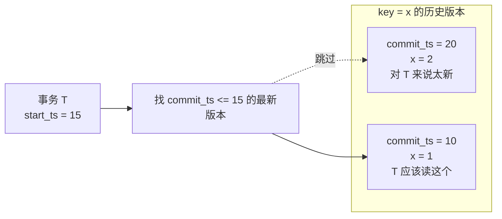

这就是 MVCC：Multi-Version Concurrency Control，多版本并发控制。

白话理解就一句：

```text
同一个 key 保存多个版本，读的时候按事务的 start_ts 选一个它应该看到的版本。
```

## 两个时间戳

Lab4 里最常见的是两个时间戳。

| 名字 | 白话解释 | 用在哪里 |
|---|---|---|
| `start_ts` | 事务开始时间 | 决定这个事务能看到哪些版本 |
| `commit_ts` | 事务提交成功时间 | 决定这批写入从什么时候开始对别人可见 |

可以这样记：

```text
start_ts：我进门时是几点。
commit_ts：我把账正式写进账本时是几点。
```

读的时候主要看 `start_ts`：

```text
我要读我进门那一刻能看到的数据。
```

提交的时候写入 `commit_ts`：

```text
这次写入从这个提交时间开始正式可见。
```

还有一个小原则：

```text
commit_ts 必须大于 start_ts。
```

## 三个 CF 的分工

Lab1 里你已经见过 Column Family，简称 CF。到 Lab4，它们终于真正派上大用场。

可以先把三个 CF 想成三个抽屉：

```text
default 抽屉：放货物本身，也就是真正的 value。
write 抽屉：放正式入账记录，告诉你某个版本已经提交。
lock 抽屉：放临时占用牌，告诉别人这个 key 正在被某个事务处理。
```

| CF | key 怎么存 | value 放什么 | 白话解释 |
|---|---|---|---|
| `default` | `user_key + start_ts` | 真正的用户 value | 临时写入的货物本体 |
| `write` | `user_key + commit_ts` | `Write{start_ts, kind}` | 正式提交记录，指向 default 里的 value |
| `lock` | `user_key` | `Lock{primary, start_ts, ttl, kind}` | 事务锁，说明这个 key 正在预写 |

图上看是这样：

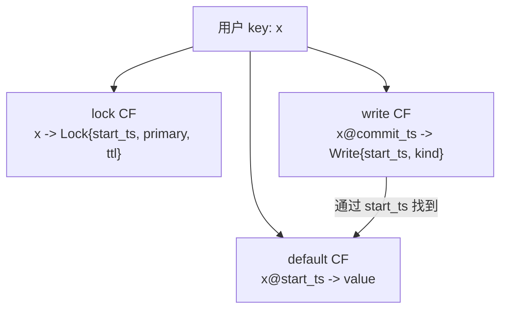

重点是：真正的 value 不在 `write` 里。

```text
default 存 value。
write 存提交记录。
write 里的 start_ts 会带你回 default 找 value。
```

再加一个实现细节：`user_key` 和时间戳会被编码成一个底层 key。编码后的排序规则大概是：

```text
先按 user_key 升序排。
同一个 user_key 内，按时间戳降序排。
```

这样扫 `write` CF 时，同一个 key 的最新版本会先被看到。

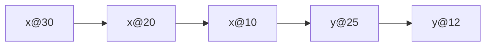

这个排序对 `GetValue` 和 `Scanner` 很关键，因为它们都要快速找到“某个事务可见的最新版本”。

## Lab4 分成三部分

官方 Project4 分成 A、B、C 三段。

| 部分 | 要做什么 | 白话解释 |
|---|---|---|
| Part A | MVCC 存储层 | 会存多版本，会查锁、查提交记录、按时间戳读正确版本 |
| Part B | `KvGet`、`KvPrewrite`、`KvCommit` | 实现事务最核心的读、预写、提交 |
| Part C | `KvScan`、`KvCheckTxnStatus`、`KvBatchRollback`、`KvResolveLock` | 处理扫描、回滚、遗留锁、半路失败 |

可以理解成：

```text
Part A：先把账本、锁、版本这些底层工具做好。
Part B：用这些工具完成一笔正常事务。
Part C：处理事务不正常时留下的现场。
```

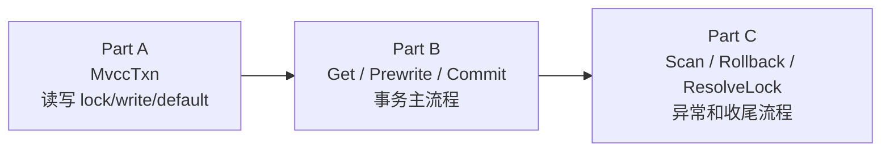

对应到测试命令和代码范围：

| 命令 | 所属阶段 | 主要文件 | 要证明什么 |
|---|---|---|---|
| `make project4a` | Lab4A | `kv/transaction/mvcc/transaction.go`、`kv/transaction/mvcc/scanner.go` | MVCC 底层能正确读写 lock/write/default，能按时间戳找可见版本 |
| `make project4b` | Lab4B | `kv/server/server.go` | `KvGet`、`KvPrewrite`、`KvCommit` 能跑通事务正常路径 |
| `make project4c` | Lab4C | `kv/server/server.go`、`kv/transaction/mvcc/scanner.go` | `KvScan`、回滚、检查事务状态、处理遗留锁能工作 |
| `make project4` | Lab4 全部 | 上面所有事务模块 | A/B/C 全部通过 |

Lab4 的代码容易看晕，可以先记住分层：`mvcc` 包提供“怎么操作版本和锁”的工具，`server.go` 里的事务 handler 负责“什么时候调用这些工具”。

## 当前本地状态

本地这份 Lab4 已经完成并通过最近一次完整回归：

```bash
make project4
```

当前实现可以按提交和代码范围这样理解：

| 阶段 | 本地提交 | 主要改动 | 粗略代码量 |
|---|---|---|---|
| Lab4A | `8c8bf3e` | 补齐 `MvccTxn` 的 lock/write/default 读写和版本查询工具 | 主要在 `transaction.go`，约一百多行 |
| Lab4B | `791722a` | 实现 `KvGet`、`KvPrewrite`、`KvCommit` 的事务正常路径 | 主要在 `server.go`，约一百多行 |
| Lab4C-1 | `d137e5a` | 实现 `KvScan`、`KvBatchRollback` 和 scanner 逻辑 | 约两百行改动 |
| Lab4C-2 | `9e4c8cb` | 实现 `KvCheckTxnStatus`、`KvResolveLock` | 约一百多行改动 |

所以之前问“Lab4C 代码量大不大”时，可以这样记：

```text
Lab4C 不算概念最大，但分支情况最多。
两次提交合起来大概三百多行改动，是 Lab4 里偏大的部分，因为它同时处理 scan、rollback、check status、resolve lock。
真正难点不是写很多代码，而是把已提交、已回滚、锁存在、锁超时、锁不存在这些状态分清楚。
```

本地实际推进顺序是：

```text
先完成 Lab4A 的 MVCC 基础工具
  -> 再做 Lab4B 的正常事务路径
  -> 然后做 Lab4C 的 scan 和 rollback
  -> 最后补 CheckTxnStatus 和 ResolveLock
```

## Part A：MVCC 存储层

Part A 主要实现 `MvccTxn`。

这里容易混淆一个点：

```text
MvccTxn 不是 TinySQL 那种“一整个用户事务”。
它更像 TinyKV 内部执行一个命令时用的小事务。
```

比如一次 `KvPrewrite` 会创建一个 `MvccTxn`，把要写的 lock、default、write 改动先收集起来，最后一次性写到底层存储。

Part A 常见方法可以按用途记：

| 能力 | 大概做什么 |
|---|---|
| 读锁 | 看某个 key 当前有没有 `lock` |
| 写锁 / 删锁 | 在 `lock` CF 里加锁或移除锁 |
| 写 value | 把用户 value 写进 `default` CF 的 `key@start_ts` |
| 写提交记录 | 把 `Write` 写进 `write` CF 的 `key@commit_ts` |
| 找可见版本 | 在 `write` CF 找 `commit_ts <= start_ts` 的最新记录 |
| 找本事务记录 | 判断某个 `start_ts` 是否已经提交或回滚 |

常见要补的文件：

| 文件 | 主要任务 |
|---|---|
| `kv/transaction/mvcc/transaction.go` | `MvccTxn` 的读锁、写锁、写 value、写提交记录、查找 write/value 等方法 |
| `kv/transaction/mvcc/scanner.go` | 按逻辑 key 扫描可见版本，跳过同一个 key 的旧版本 |
| `kv/transaction/mvcc/lock.go`、`write.go` | 理解 `Lock` 和 `Write` 的编码格式，通常框架已给出 |

Part A 的难点通常是读路径，因为你不是直接按 key 读 value，而是要：

```text
先查 write 记录，再根据 write 记录里的 start_ts 去 default 读 value。
```

## 读流程：KvGet

事务读不是直接读 `default`。

先用一句话说：

```text
读一个 key 时，先看有没有挡路的锁；没有锁，再去 write 找可见提交记录；最后去 default 拿真正 value。
```

流程图：

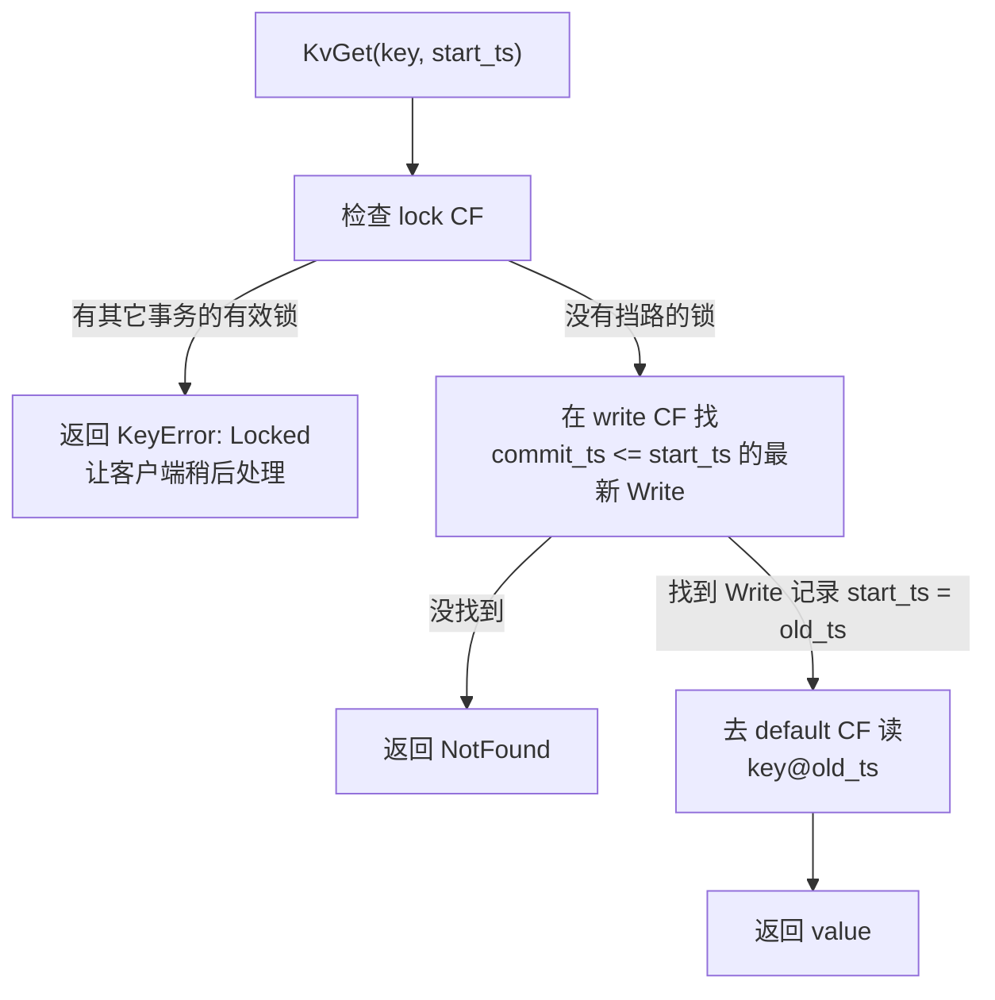

时序图：

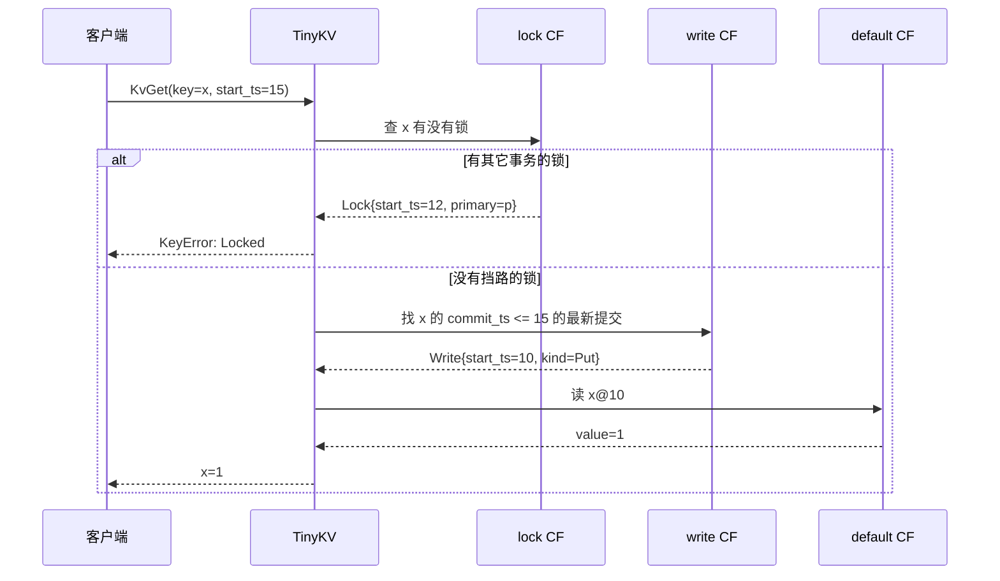

`KvScan` 可以理解成很多次 `KvGet` 的顺序版，但实现更麻烦，因为底层存了很多版本。它不能像 RawScan 那样直接扫底层 key/value，而是要用 `Scanner` 按逻辑 key 一个个吐出可见版本。

## 写事务总览

TinyKV 的事务设计借鉴 Percolator，用的是两阶段提交。

生活化理解：

```text
第一阶段 Prewrite：先占位置，把临时 value 放进去。
第二阶段 Commit：正式入账，别人从此能看到。
```

更完整的客户端流程是：

```text
1. 客户端从 TinyScheduler 拿 start_ts。
2. 客户端执行事务逻辑，读用 KvGet/KvScan，写先记在本地内存。
3. 准备提交时，客户端选一个 key 作为 primary key。
4. 客户端向相关 Region 发送 KvPrewrite。
5. 所有 Prewrite 成功后，客户端拿 commit_ts。
6. 客户端先提交 primary key 所在 Region。
7. primary commit 成功后，再提交其它 secondary key。
8. 如果 Prewrite 或 primary commit 失败，就回滚。
```

这里的 primary key 不是 SQL 表里的主键。它只是这次事务选出来的“代表 key”。以后别人遇到锁，就会优先检查 primary key 的状态，用它判断整个事务到底是已提交、还活着，还是该回滚。

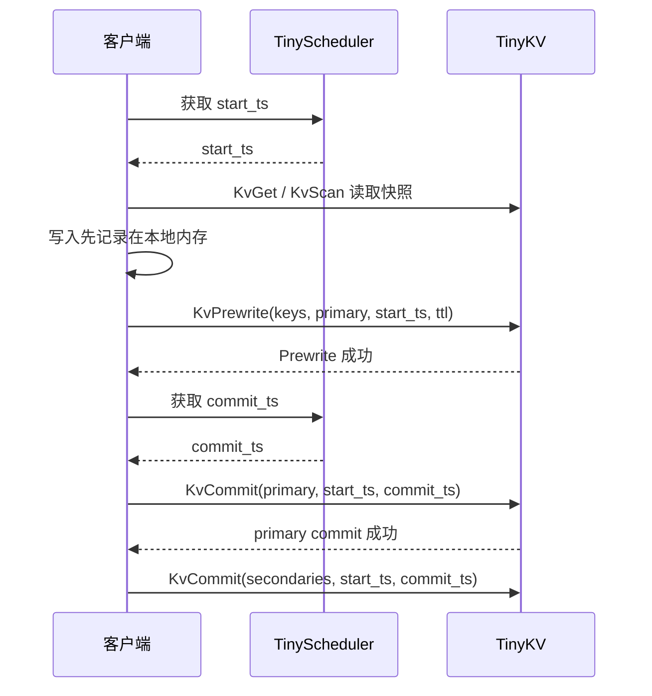

## Prewrite 做什么

`KvPrewrite` 是真正把 value 写入 TinyKV 的阶段，但这个写入还不是正式可见。

对每个 key，它大概做四件事：

```text
1. 检查有没有其它事务的锁。
2. 检查有没有写冲突。
3. 把 value 写到 default CF 的 key@start_ts。
4. 在 lock CF 写一把锁，锁里带 primary、start_ts、ttl、kind。
```

用三个 CF 看：

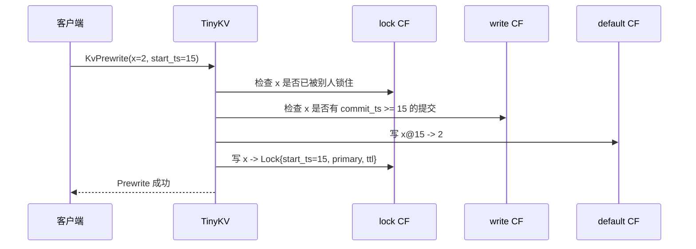

注意顺序从理解上可以记成“先检查，再写 default 和 lock”。实际代码里只要保证一次命令的改动最后原子落盘即可。

## 写冲突检查

写冲突是 Lab4 最容易问的点。

先看例子：

```text
事务 A 在 start_ts=15 开始，准备写 x。
事务 B 在 commit_ts=20 已经写了 x。

对 A 来说，B 是在 A 开始之后才提交的。
如果 A 还继续写 x，就会覆盖一个它开始时根本没看到的版本。
所以 A 必须失败。
```

Prewrite 时还没有 `commit_ts`，所以检查方式是：

```text
去 write CF 查这个 key 有没有 commit_ts >= start_ts 的提交记录。
如果有，就说明我开始之后别人提交过这个 key，产生 write conflict。
```

这里说的“覆盖”不是把 `default CF` 里的旧 value 物理覆盖掉。MVCC 会保留多个版本，例如：

```text
default CF:
  x@20 -> 101
  x@25 -> 200
```

真正的问题是逻辑上的覆盖。因为读请求是先看 `write CF`，而 `write CF` 同一个 user key 下是按 `commit_ts` 从新到旧找版本的。谁的 `commit_ts` 更大，谁就会被后续读请求当成更新版本。

举个例子：

```text
事务 B:
  start_ts = 20
  读到旧值 x = 100
  准备写 x = 101

事务 A:
  start_ts = 25
  commit_ts = 30
  已经提交 x = 200
```

如果不做写冲突检查，让事务 B 继续提交，并且 B 最后拿到：

```text
B commit_ts = 40
```

那么 `write CF` 会变成：

```text
x@40 -> Write{start_ts=20, kind=Put}  // B
x@30 -> Write{start_ts=25, kind=Put}  // A
```

之后别人读取 `version = 50` 时，会先看到 `x@40`，于是读到 B 的 `x@20 -> 101`。这样 A 已经提交的 `x@25 -> 200` 虽然物理上还在，但在最新读视角里被 B 盖过去了。

所以写冲突检查要阻止这种情况：

```text
我的 start_ts 之后，如果别人已经提交过同一个 key，
我就不能再提交这个 key。
```

也就是：

```text
MostRecentWrite(key) 的 commit_ts >= 当前事务 start_ts
=> WriteConflict
```

可以这样区分读和写：

```text
读：未来版本看不见，可以跳过。
写：如果 start_ts 之后已经有人提交同一个 key，不能跳过，必须报冲突。
```

图上看：

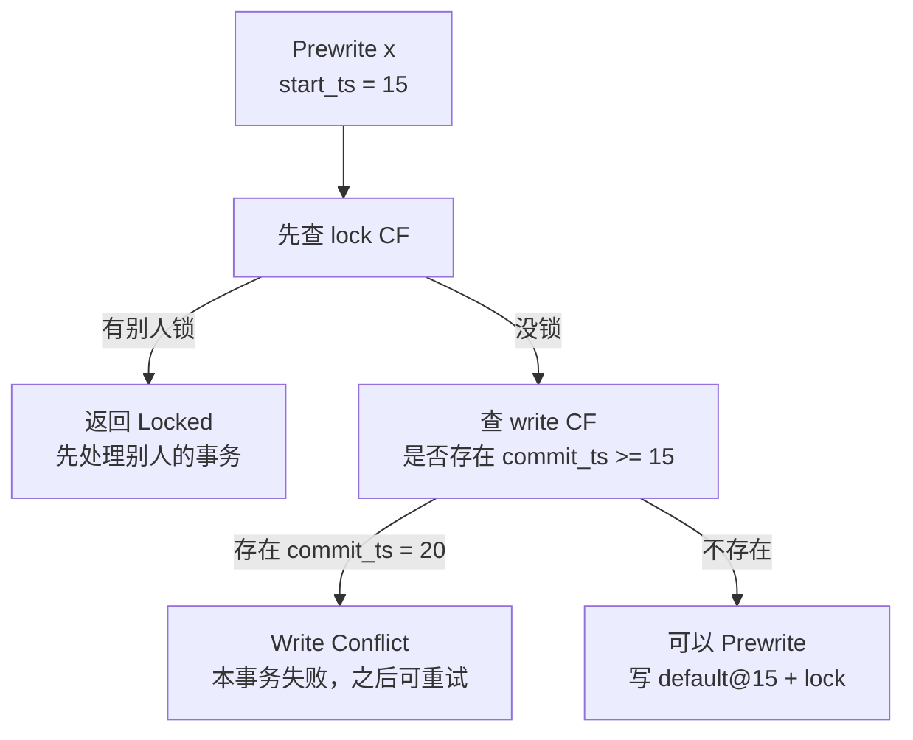

可以用一句面试话记住：

```text
Prewrite 要阻止两类问题：一个是别人正在写，也就是 lock conflict；另一个是我开始之后别人已经写完了，也就是 write conflict。
```

## Commit 做什么

`KvCommit` 不再写真正 value。真正 value 在 Prewrite 阶段已经写到 `default` 了。

Commit 做的是：

```text
1. 确认这个 key 上的锁还在。
2. 确认锁属于当前事务，也就是 lock.ts == start_ts。
3. 在 write CF 写提交记录 key@commit_ts -> Write{start_ts, kind}。
4. 删除 lock CF 里的锁。
```

图上看：

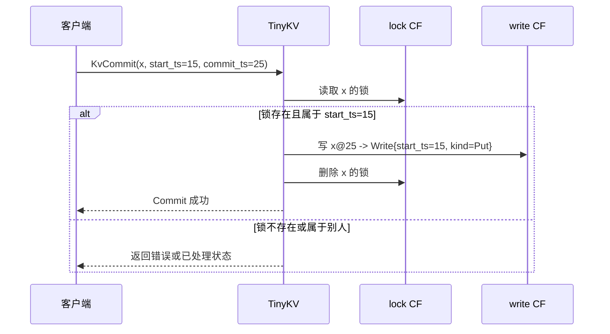

Commit 成功以后，读者不会直接看 `default@15`。它会先在 `write` 里看到：

```text
x@25 -> Write{start_ts=15}
```

然后才去 `default` 里读：

```text
x@15 -> value
```

也就是说：

```text
default 负责存值。
write 负责宣布这个值从 commit_ts 开始可见。
```

## 两阶段提交图

把 Prewrite 和 Commit 合起来，就是 Lab4 的核心主流程。

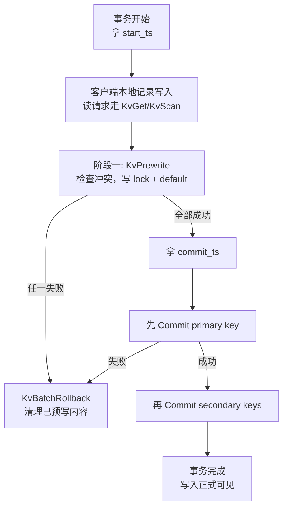

为什么要先提交 primary key？

```text
primary key 像这次事务的总开关。
primary commit 成功，说明整个事务已经决定提交。
之后 secondary keys 再遇到锁，也应该被 ResolveLock 推进到提交。

primary commit 失败，说明事务没有正式成功，客户端会回滚它。
```

官方文档里还有一个关键承诺：

```text
只要某个 key 的 Prewrite 成功，服务器就承诺后面收到这个事务的 Commit 时应该能成功。
```

所以一旦 primary commit 成功，其它 key 就不应该再因为超时被随便回滚。

## 遇到锁怎么办

分布式事务最麻烦的是：一个事务可能 Prewrite 到一半，客户端就挂了。

比如：

```text
事务 A 已经给 key1 写了 lock 和临时 value。
但是 A 还没来得及 Commit，客户端崩了。
事务 B 后来读写 key1，发现这里有 A 的锁。
```

这时 B 不能直接删锁，也不能直接等到天荒地老。它要去问：

```text
A 到底已经提交了？
A 只是还没提交但没超时？
A 已经超时，应该回滚？
```

TinyKV 用 `KvCheckTxnStatus` 和 `KvResolveLock` 来处理。

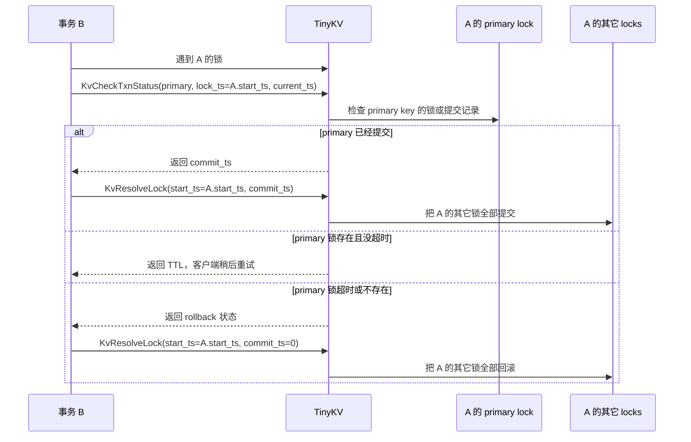

几个重点：

| 接口 | 白话解释 |
|---|---|
| `KvCheckTxnStatus` | 看 primary key 代表的事务现在是什么状态 |
| `KvResolveLock` | 批量处理同一个 `start_ts` 留下的锁 |
| `commit_ts > 0` | ResolveLock 会提交这些锁 |
| `commit_ts = 0` | ResolveLock 会回滚这些锁 |

还有一个容易漏的点：

```text
TinyKV 不会自己定时扫描 TTL。
TTL 检查通常是别的事务撞到锁以后，由客户端发 KvCheckTxnStatus 触发的。
```

计算 TTL 是否过期时，要看 timestamp 的物理时间部分，可以用 `PhysicalTime` 辅助函数。

## Rollback 做什么

Rollback 的目标不是“把一切当作没发生过”这么简单。

它要做两件事：

```text
1. 清理这个事务预写过的临时现场。
2. 留下一条 rollback 记录，告诉以后的人：这个 start_ts 已经作废。
```

以 `x` 为例，Prewrite 之后可能是：

```text
lock CF:    x -> Lock{start_ts=15}
default CF: x@15 -> 临时 value
write CF:   暂时还没有正式提交记录
```

Rollback 之后应该变成：

```text
lock CF:    x 的锁被删除
default CF: x@15 的临时 value 被删除
write CF:   留一条 Rollback 记录
```

图上看：

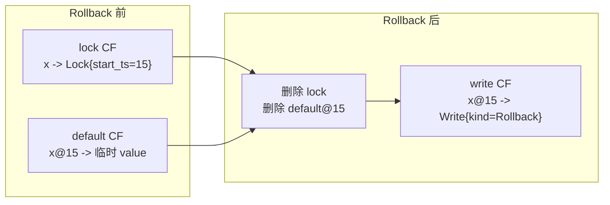

为什么要留下 Rollback 记录？

因为网络里可能有迟到的请求。

```text
事务 A 已经被回滚。
可是一个迟到的 Commit(A) 请求又到了。
如果没有 rollback 记录，系统可能搞不清 A 到底是什么状态。
有了 rollback 记录，就能明确拒绝这次迟到提交。
```

所以 rollback 记录像一张“作废单”。

`KvBatchRollback` 大概逻辑是：

```text
如果这个 key 已经被同一个 start_ts 正式提交，不能回滚。
如果这个 key 有当前事务的锁，删除锁和临时 value，并写 rollback 记录。
如果这个 key 没有锁也没有提交，也写 rollback 记录，防止迟到 commit。
```

## Part B：读、预写、提交

Part B 要实现三个 gRPC handler，通常在 `kv/server/server.go` 里：

| 接口 | 白话解释 |
|---|---|
| `KvGet` | 按 `start_ts` 读一个 key 的可见版本 |
| `KvPrewrite` | 检查冲突，写锁和临时 value |
| `KvCommit` | 写提交记录，删锁，让版本正式可见 |

实现时要注意两个层次：

```text
事务语义层：锁、写冲突、提交、回滚。
本地并发层：多个请求可能同时到达同一个 TinyKV 节点。
```

本地并发层可以用 `latches`，它像每个 key 一把本地互斥锁，避免同一个 key 的 commit 和 rollback 在本地交叉执行。

Part B 的正常事务路径可以压成一句：

```text
KvGet 负责按 start_ts 读快照；
KvPrewrite 负责检查冲突，然后写 default + lock；
KvCommit 负责把 lock 变成 write 记录，并删除 lock。
```

## Part C：扫描、回滚、处理锁

Part C 要实现四个接口：

| 接口 | 白话解释 |
|---|---|
| `KvScan` | 从某个 key 开始，按 `start_ts` 扫一批可见 key/value |
| `KvCheckTxnStatus` | 检查某个事务的 primary key 状态，必要时处理超时 |
| `KvBatchRollback` | 回滚一批 key |
| `KvResolveLock` | 批量处理某个事务留下的锁，提交或回滚 |

这些接口解决的都是“事务不顺利时怎么办”。

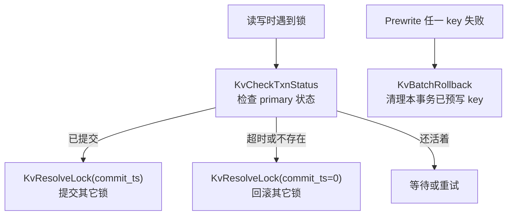

可以这样记：

```text
Part B 是事务正常走完的流程。
Part C 是事务半路摔倒以后，系统怎么把现场收拾干净。
```

## 怎么测试

Lab4 总测试：

```bash
make project4
```

也可以分开跑：

```bash
make project4a
make project4b
make project4c
```

每个小阶段大概测：

| 命令 | 测什么 |
|---|---|
| `make project4a` | 多版本读写、锁、提交记录、`MvccTxn` |
| `make project4b` | `KvGet`、`KvPrewrite`、`KvCommit` |
| `make project4c` | `KvScan`、回滚、检查事务状态、处理锁 |

主要测试文件：

```text
kv/transaction/mvcc/transaction_test.go
kv/transaction/commands4b_test.go
kv/transaction/commands4c_test.go
```

更完整的测试命令在 [测试指南](./testing-guide.md)。

## 面试怎么说

可以这样讲：

> TinyKV Lab4 是在已有 KV 和 Raft/Multi-Raft 存储能力上实现事务层。它用 MVCC 支持快照隔离，同一个 key 会保留多个版本；底层通过 `default`、`write`、`lock` 三个 CF 分别保存真实 value、提交记录和事务锁。读请求按 `start_ts` 找可见版本，写请求走 Percolator 风格两阶段提交：先 `Prewrite` 检查锁和写冲突，写临时 value 和 lock；再 `Commit` 写提交记录并删除 lock。后半部分还要处理事务失败后的 `BatchRollback`、遇锁后的 `CheckTxnStatus` 和 `ResolveLock`，保证半路失败的事务不会留下脏状态。

如果继续追问，可以补这几个点：

| 追问 | 可以回答 |
|---|---|
| 为什么要三个 CF | `default` 存 value，`write` 存提交时间和指向 value 的 start_ts，`lock` 存未提交事务的锁 |
| 怎么判断读哪个版本 | 在 `write` CF 找 `commit_ts <= start_ts` 的最新记录，再去 `default` 读 value |
| 写冲突怎么判断 | Prewrite 时查这个 key 是否有 `commit_ts >= start_ts` 的提交记录 |
| 为什么要 primary key | primary key 是事务状态代表，遇到锁时通过它判断整个事务该提交、等待还是回滚 |
| rollback 记录有什么用 | 防止迟到的 Commit 把已经回滚的事务重新提交 |

## 和 MIT 6.5840 的关系

MIT 6.5840 标准实验基本没有 TinyKV Lab4 这一层。

| TinyKV Lab4 | MIT 6.5840 |
|---|---|
| MVCC 多版本 | 基本没有 |
| Snapshot Isolation | 基本没有 |
| Percolator 两阶段提交 | 基本没有 |
| 事务锁和 TTL | 基本没有 |
| 回滚和处理遗留锁 | 基本没有 |

MIT 更关注：

```text
Raft
线性一致
副本容错
分片迁移
```

TinyKV Lab4 更关注：

```text
数据库事务
多版本读
写冲突
事务锁
回滚和锁清理
```

所以可以这样对比：

```text
MIT 6.5840 更像分布式系统基本功训练。
TinyKV Lab4 更像分布式数据库事务层训练。
```

如果面试时把两者连起来讲，可以说：

> MIT 的 RaftKV/ShardedKV 主要训练怎么让复制状态机和分片系统保持一致；TinyKV 前三部分也做存储、Raft 和 Region，但 Lab4 进一步往数据库方向走，加入 MVCC、事务锁、两阶段提交和回滚处理。

## 参考资料

- Project 4 Transactions：https://github.com/talent-plan/tinykv/blob/course/doc/project4-Transaction.md
- TinyKV 仓库：https://github.com/talent-plan/tinykv
- Percolator 论文：https://storage.googleapis.com/pub-tools-public-publication-data/pdf/36726.pdf
- 本仓库官方文档：`doc/project4-Transaction.md`
- 本仓库源码：`kv/transaction/mvcc/transaction.go`
- 本仓库源码：`kv/transaction/mvcc/lock.go`
- 本仓库源码：`kv/transaction/mvcc/write.go`
- 本仓库源码：`kv/transaction/mvcc/scanner.go`
- 本仓库源码：`kv/server/server.go`
- 本仓库源码：`kv/transaction/latches/latches.go`
